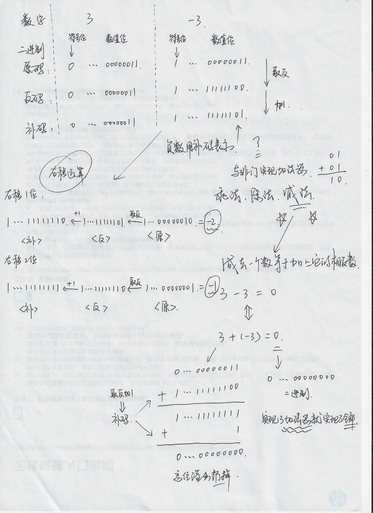
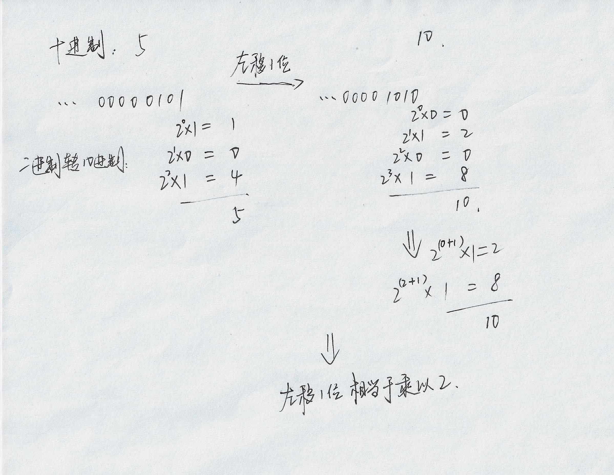
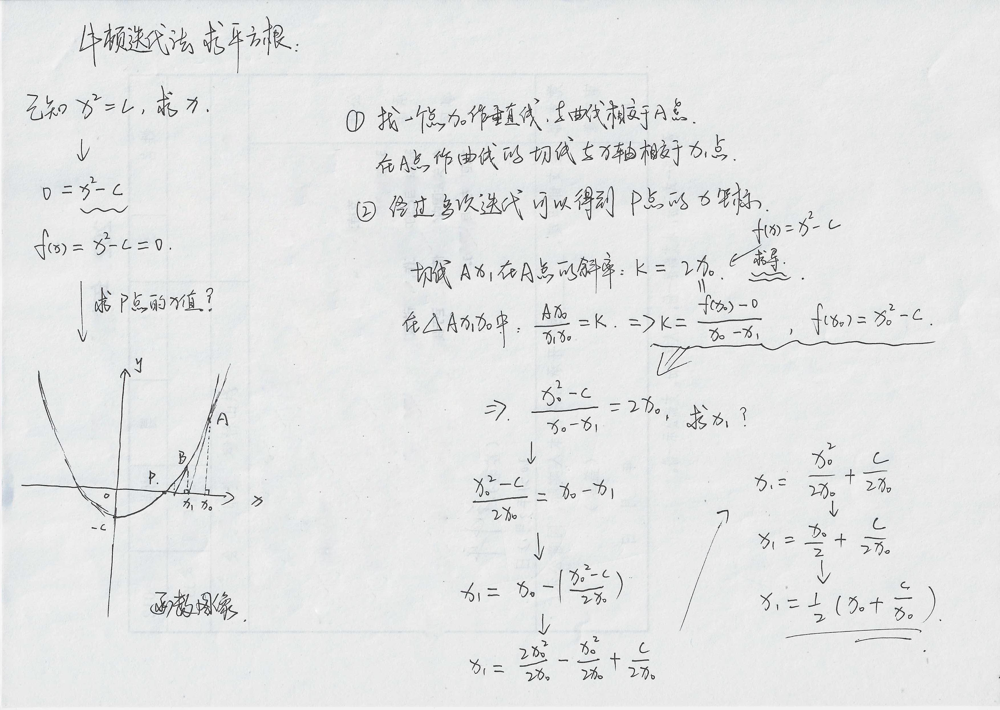
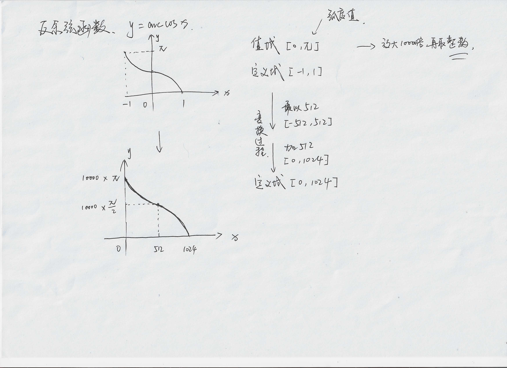
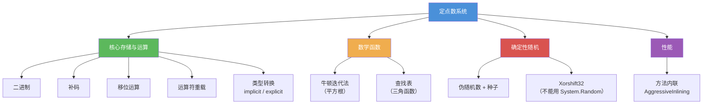

# 基础知识必备

这篇文档覆盖的内容和定点数本身无关，但它们是实现定点数系统之前必须掌握的前置知识。  
如果这些概念已经很熟悉了，可以直接跳到 `2.定点数实现原理.md`。

---

## 1. 二进制

我们日常用十进制（逢十进一），计算机用二进制（逢二进一）。  
后续章节中的移位运算、补码、查找表索引计算等，全部建立在二进制的基础上。

### 1.1 十进制转二进制

方法：对目标数字反复除以 2，记录每次的余数，最后把余数从下往上排列。

以 13 为例：

```text
13 ÷ 2 = 6 ... 余 1
 6 ÷ 2 = 3 ... 余 0
 3 ÷ 2 = 1 ... 余 1
 1 ÷ 2 = 0 ... 余 1

余数从下往上排列 → 1101
```

所以十进制 13 = 二进制 1101。

### 1.2 二进制转十进制

从最低位（最右边）开始，每一位的值 = 该位数字 × 2 的对应幂次，最后求和。

```text
二进制 1101 拆解：

第 0 位（最右）：1 × 2⁰ = 1 × 1 = 1
第 1 位：        0 × 2¹ = 0 × 2 = 0
第 2 位：        1 × 2² = 1 × 4 = 4
第 3 位（最左）：1 × 2³ = 1 × 8 = 8

合计：1 + 0 + 4 + 8 = 13
```

建议自己拿几个数字（比如 7、20、100）练习几遍，很快就能形成直觉。

### 1.3 常用的 2 的幂次

下面这些数字在后续文档中会反复出现，值得提前记住：

| 表达式 | 值 | 在哪里会遇到 |
|---|---|---|
| 2⁰ | 1 | — |
| 2¹ | 2 | 左移 1 位等价于乘以 2 |
| 2⁸ | 256 | 一个字节的取值范围 |
| 2¹⁰ | 1024 | **本库的放大倍数（Q10 格式）** |
| 2¹⁶ | 65536 | Q16 格式常用 |
| 2³¹ | ≈ 21.5 亿 | `int` 的最大值 |
| 2⁶³ | ≈ 9.2 × 10¹⁸ | `long` 的最大值 |

其中 **2¹⁰ = 1024** 是本库的核心常量，出现频率极高。

---

## 2. 原码、反码、补码

这三个概念解决的是同一个问题：**计算机如何表示负数**。  
最终胜出的是补码，但理解它的优势需要先了解另外两种方案的不足。



为了便于理解，下面统一用 **8 位有符号整数**举例。  
实际程序中 `int` 是 32 位、`long` 是 64 位，原理完全相同，只是位数更多。

8 位有符号整数的规则：最高位是符号位（0 表示正，1 表示负），剩余 7 位表示数值。

### 2.1 原码（Sign-Magnitude）

规则最直观：符号位 + 绝对值的二进制表示。

```text
+5 → 0|000 0101    （符号位 0，数值部分 5）
-5 → 1|000 0101    （符号位 1，数值部分 5）
```

问题在于零有两种编码：

```text
+0 → 0|000 0000
-0 → 1|000 0000
```

这导致判等逻辑需要处理两种情况。更大的问题是加减法——正数与负数相加时，硬件不能直接把两个原码丢进加法器，需要先判断符号、比较绝对值大小、决定结果符号，电路实现相当复杂。

### 2.2 反码（Ones' Complement）

正数的反码与原码相同。负数的反码：符号位保持 1，其余各位按位取反。

```text
+5 反码 → 0000 0101
-5 反码 → 1111 1010    （0000 0101 逐位取反）
```

反码在加法运算上比原码好一些，但零的二义性仍然存在：

```text
+0 → 0000 0000
-0 → 1111 1111
```

### 2.3 补码（Two's Complement）

正数的补码与原码相同。负数的补码 = 反码 + 1。

```text
+5 补码 → 0000 0101
-5：先取反 → 1111 1010，再加 1 → 1111 1011
```

**核心记忆：负数补码 = 对应正数按位取反再加 1。**

### 2.4 补码为什么成为最终方案

在硬件设计中，补码有三个决定性的优势：

**（一）加法器可以统一处理加减法**

在补码体系中，`a - b` 等价于 `a + (-b)`。CPU 只需要一套加法电路就能完成所有加减运算。

以 `7 - 5` 为例，展开为 `7 + (-5)` 并手算：

```text
  7 的补码：  0000 0111
 -5 的补码：  1111 1011

    0000 0111
  + 1111 1011
  -----------
  1 0000 0010
    ↑
    这一位溢出了，8 位存不下，直接丢弃
    剩余 0000 0010 = 2，结果正确
```

硬件不需要关心操作数是正还是负，直接把补码丢进加法器就行。

**（二）零只有唯一的编码**

对 +0 走一遍"取反加一"流程：

```text
+0 → 0000 0000
取反 → 1111 1111
加 1 → 1 0000 0000（9 位）
8 位截断 → 0000 0000
```

结果和 +0 完全相同。补码中不存在 "-0" 这个概念，判等逻辑只需比较一次。

**（三）符号扩展规则简单**

当 `int` 转为 `long` 时，正数高位补 0，负数高位补 1，数值不变。这叫符号扩展。

```text
+5（8位）：0000 0101 → 扩展到 16 位：0000 0000 0000 0101（仍然是 5）
-5（8位）：1111 1011 → 扩展到 16 位：1111 1111 1111 1011（仍然是 -5）
```

补码天然兼容这种扩展行为，不需要额外的转换逻辑。

### 2.5 验证：3 + (-3) = 0

```text
  +3 补码：0000 0011
  -3 补码：取反 1111 1100，加 1 → 1111 1101

    0000 0011
  + 1111 1101
  -----------
  1 0000 0000 → 8 位截断 → 0000 0000 = 0 ✓
```

### 2.6 -1 的补码是全 1

这是一个在位运算中经常会遇到的事实：

```text
+1 → 0000 0001
取反 → 1111 1110
加 1 → 1111 1111
```

所以 -1 在 8 位下是 `0xFF`，32 位下是 `0xFFFFFFFF`，64 位下是 `0xFFFFFFFFFFFFFFFF`。  
掩码运算和符号传播中经常会利用到这个性质。

### 2.7 负数右移的行为

在 C# 中，有符号整数的右移是算术右移——左侧补符号位（负数补 1，正数补 0）。  
这会导致一个初看不太直觉的结果：

```csharp
int a = -8;
int b = a >> 1;   // 结果是 -4，而不是 4
```

用 8 位补码手算验证：

```text
-8 补码 → 1111 1000
右移 1 位（算术右移，左侧补符号位 1）→ 1111 1100

验证 1111 1100 对应的值：
  减 1 → 1111 1011
  取反 → 0000 0100 = 4
  加上负号 → -4
```

这不是 bug，而是补码和算术右移共同决定的结果。  
在定点数的实现中会涉及大量右移操作，理解这个行为非常重要。

### 2.8 C# 验证代码

可以把下面这段代码放到项目中实际运行，对照输出加深理解：

```csharp
using System;

public static class BitDemo
{
    /// <summary>
    /// 将 int 的低 8 位格式化为二进制字符串，方便演示
    /// </summary>
    static string ToBinary8(int value)
    {
        return Convert.ToString(value & 0xFF, 2).PadLeft(8, '0');
    }

    public static void Run()
    {
        // ---- 第一部分：验证补码规则 ----
        int positive = 5;
        int negative = -5;

        // 直接查看运行时内存中的低 8 位
        Console.WriteLine($"+5 低8位: {ToBinary8(positive)}");   // 00000101
        Console.WriteLine($"-5 低8位: {ToBinary8(negative)}");   // 11111011

        // 手动走一遍"取反加一"过程，验证结果是否与 -5 的存储一致
        int inverted = (~positive) & 0xFF;                       // 取反：11111010
        int complement = (inverted + 1) & 0xFF;                  // 加一：11111011
        Console.WriteLine($"取反: {Convert.ToString(inverted, 2).PadLeft(8, '0')}");
        Console.WriteLine($"加一: {Convert.ToString(complement, 2).PadLeft(8, '0')}");

        // ---- 第二部分：验证算术右移行为 ----
        int x = -8;
        int shifted = x >> 1;
        Console.WriteLine($"-8 >> 1 = {shifted}");              // -4
        Console.WriteLine($"-8 低8位:   {ToBinary8(x)}");       // 11111000
        Console.WriteLine($"结果低8位:  {ToBinary8(shifted)}");  // 11111100
        // 可以看到左侧补了符号位 1，而不是 0
    }
}
```

---

## 3. 移位运算

移位运算是定点数系统的基石。整个 Q10 格式（放大 1024 倍）的实现基础就是左移 10 位。



### 3.1 左移 `<<`

将所有二进制位向左移动指定位数，右侧补 0。  
**左移 N 位 = 乘以 2^N。**

```text
5 的二进制：  0000 0101

左移 1 位：   0000 1010 = 10     等价于 5 × 2¹ = 5 × 2
左移 2 位：   0001 0100 = 20     等价于 5 × 2² = 5 × 4
左移 3 位：   0010 1000 = 40     等价于 5 × 2³ = 5 × 8
左移 10 位：  在 Q10 格式下就是 5 × 1024 = 5120
```

这正是本库将普通整数转为定点数内部值的做法：

```csharp
int hp = 5;
// 左移 10 位 = 乘以 1024，得到 Q10 格式的内部值
long fixedValue = (long)hp << 10;   // 5120
```

### 3.2 右移 `>>`

将所有二进制位向右移动，丢弃最低位。  
对有符号整数，C# 使用算术右移（左侧补符号位）。  
**右移 N 位 ≈ 除以 2^N**（整数语义，不是精确除法）。

```text
20 的二进制：  0001 0100

右移 1 位：    0000 1010 = 10    等价于 20 / 2
右移 2 位：    0000 0101 = 5     等价于 20 / 4
```

需要注意的是，右移会直接丢弃最低位，不做四舍五入：

```csharp
// 5 / 2 = 2.5，但整数右移直接截断
int result = 5 >> 1;    // 结果是 2，不是 3
```

对于负数，算术右移是向负无穷方向截断，而整数除法是向零截断：

```csharp
int a = -7 >> 1;    // 算术右移：结果是 -4（向负无穷截断）
int b = -7 / 2;     // 整数除法：结果是 -3（向零截断）
```

这个区别在后面讲定点数乘法实现时会详细讨论——这也是本库乘法缩回时选择 `/ 1024` 而非 `>> 10` 的原因。

### 3.3 左移溢出

左移时如果结果超出类型范围，高位会被截断，导致完全错误的结果：

```csharp
int maxInt = 2147483647;    // int.MaxValue
int overflow = maxInt << 1; // 溢出，结果变成 -2
```

在编写涉及移位的代码时，必须提前评估结果是否可能超出类型范围。

---

## 4. C# 运算符重载

运算符重载允许自定义类型使用 `+`、`-`、`*`、`/` 等标准运算符。  
对于定点数这种需要频繁做算术运算的类型来说，这个特性是代码可读性的关键。

### 4.1 没有运算符重载时

```csharp
// 不重载的话，每个运算都要写成方法调用，嵌套起来非常难读
var damage = FixedPoint.Add(
    FixedPoint.Mul(atk, FixedPoint.FromInt(2)),
    FixedPoint.FromInt(10)
);
```

### 4.2 有运算符重载时

```csharp
// 重载后，代码几乎等于策划公式的直接翻译
FixedPoint damage = atk * 2 + 10;
```

两段代码做的是同一件事，但可读性差距巨大。

### 4.3 实现方式

在 struct 或 class 内部定义一个特殊签名的静态方法：

```csharp
public struct MyNumber
{
    public int Value;

    public MyNumber(int v)
    {
        Value = v;
    }

    /// <summary>
    /// 重载加法运算符，使 MyNumber 实例可以直接使用 + 号
    /// </summary>
    public static MyNumber operator +(MyNumber a, MyNumber b)
    {
        return new MyNumber(a.Value + b.Value);
    }

    /// <summary>
    /// 重载乘法运算符
    /// </summary>
    public static MyNumber operator *(MyNumber a, MyNumber b)
    {
        return new MyNumber(a.Value * b.Value);
    }
}

// 使用示例
MyNumber x = new MyNumber(3);
MyNumber y = new MyNumber(5);
MyNumber z = x + y;    // z.Value = 8，和普通整数一样的写法
```

### 4.4 可重载的运算符

| 类别 | 运算符 |
|---|---|
| 算术 | `+` `-` `*` `/` `%` |
| 一元 | `-`（取负）`+`（取正） |
| 位移 | `<<` `>>` |
| 比较 | `==` `!=` `>` `<` `>=` `<=` |

C# 要求比较运算符必须成对重载：重载了 `==` 就必须同时重载 `!=`，重载了 `>` 就必须同时重载 `<`。

另外，重载 `==` 时编译器会建议同时重写 `Equals()` 和 `GetHashCode()`。如果不这样做，把对象放进 `Dictionary` 或 `HashSet` 时行为可能不正确（因为这些容器默认通过 `GetHashCode` 和 `Equals` 来判断相等性，而非 `==` 运算符）。

---

## 5. C# 显式转换与隐式转换

与运算符重载配套的另一个特性。  
它控制的是自定义类型与其他类型之间的转换规则——哪些转换可以自动发生，哪些必须显式声明。

### 5.1 隐式转换（implicit）

定义后，编译器会自动执行转换，不需要任何强转语法。  
适用于**转换绝对安全、不会丢失信息**的场景。

```csharp
/// <summary>
/// 让 int 可以直接赋值给 MyNumber，编译器自动调用
/// </summary>
public static implicit operator MyNumber(int value)
{
    return new MyNumber(value);
}

// 使用时不需要任何额外语法
MyNumber hp = 100;   // 编译器自动调用上面的转换
```

类比 C# 内置的 `int → long`：int 的值域完全被 long 包含，转换不可能丢失信息，所以 `long x = 42;` 不需要强转。

### 5.2 显式转换（explicit）

必须手动写强转才能通过编译。  
适用于**转换可能丢失精度、或存在语义变化**的场景。

```csharp
/// <summary>
/// MyNumber → float，必须手动写 (float) 才能转换
/// 这是有意为之：提醒开发者这里发生了精度和语义的变化
/// </summary>
public static explicit operator float(MyNumber value)
{
    return value.Value / 1024f;
}

// 使用时必须显式声明
float f = (float)myNumber;   // 不写 (float) 会编译报错
```

类比 C# 内置的 `double → int`：小数部分会被丢弃，所以编译器要求你写 `(int)myDouble`，确认你知道这里有精度损失。

### 5.3 如何选择

| 场景 | 选择 | 原因 |
|---|---|---|
| 转换安全、无损、使用频率高 | `implicit` | 减少样板代码，提升可读性 |
| 转换有损、语义变化、需要开发者确认 | `explicit` | 在代码中留下显眼标记，防止误用 |

在定点数库中，这个选择尤其关键：

- `int → FixedPoint` 用 `implicit`，因为在帧同步逻辑中大量使用，而且语义明确。
- `FixedPoint → float` 用 `explicit`，因为这意味着从"确定性运算"跨越到"非确定性运算"，开发者必须有意识地做这个决定。

### 5.4 三者在实际战斗系统中的配合

```csharp
// =========================================
// 配置阶段（从策划表读入数据）
// implicit 转换让代码像普通数值操作一样简洁
// =========================================
FixedPoint baseDamage = 120;         // int → FixedPoint 自动转换
FixedPoint critRate = 15;            // 暴击率 15%
FixedPoint critMultiplier = 2;       // 暴击倍率

// =========================================
// 核心逻辑（全程定点数运算）
// 运算符重载让公式与策划文档一一对应
// =========================================
FixedPoint finalDamage = baseDamage;
if (critRate > 10)
{
    // 运算符重载：baseDamage * critMultiplier
    // 没有运算符重载的话要写成 FixedPoint.Mul(baseDamage, critMultiplier)
    finalDamage = baseDamage * critMultiplier;
}

// =========================================
// 表现层（传给 UI 显示）
// explicit 转换强制开发者手动确认"跨出定点世界"
// =========================================
float uiDamage = (float)finalDamage;   // 必须写 (float)
ShowDamageNumber(uiDamage);
```

三个特性各自的职责非常清晰：
- **implicit**：消除高频操作的样板代码
- **运算符重载**：让业务逻辑像数学公式一样可读
- **explicit**：在语义边界处设置明确的"关卡"

---

## 6. 方法内联（AggressiveInlining）

在阅读本库源码时，会频繁看到这样一个标记：

```csharp
[MethodImpl(MethodImplOptions.AggressiveInlining)]
public static FixedPoint operator +(FixedPoint a, FixedPoint b)
{
    return new FixedPoint(Saturate(a._fixedValue + b._fixedValue));
}
```

这一节解释它是什么、解决了什么问题、以及为什么定点数库需要它。

### 6.1 什么是方法调用的开销

在 C# 中调用一个方法时，运行时需要做一系列额外工作：

```text
调用方 → 压栈参数 → 跳转到方法地址 → 执行方法体 → 返回值弹栈 → 跳转回调用处
```

这个过程涉及栈帧的创建和销毁、参数的拷贝、以及至少两次跳转（调用和返回）。对于一个执行几百行逻辑的方法来说，这些开销可以忽略不计。但对于像加法运算符这样只做一行计算的方法来说，调用开销可能比方法体本身还大。

### 6.2 内联的含义

**内联**（Inlining）是 JIT 编译器的一种优化手段：不生成方法调用指令，而是把方法体的代码直接"复制粘贴"到调用处。

用一个具体例子来理解：

```csharp
// 假设有这样一段代码
FixedPoint result = a + b + c;
```

不内联时，生成的伪指令大致为：

```text
call operator+(a, b)     ← 第一次方法调用
store temp
call operator+(temp, c)  ← 第二次方法调用
store result
```

内联后，JIT 把方法体展开，效果类似于：

```text
temp = Saturate(a._fixedValue + b._fixedValue)   ← 直接执行，无调用开销
result = Saturate(temp + c._fixedValue)
```

两次方法调用的跳转和栈操作全部消除，CPU 可以连续执行算术指令而不被打断。

### 6.3 JIT 的自动内联与它的局限

C# 的 JIT 编译器本身就会自动内联短方法，但它有一些保守的启发式规则。例如，方法体的 IL 字节码超过一定大小（通常是 64 字节）时，JIT 默认不会内联。

问题在于，某些方法虽然 C# 代码只有两三行，但编译为 IL 后体积会偏大——比如包含 `if` 分支的溢出检测逻辑。JIT 看到 IL 体积超标，就放弃了内联，即使从实际执行角度来看内联是值得的。

### 6.4 AggressiveInlining 的作用

`[MethodImpl(MethodImplOptions.AggressiveInlining)]` 是开发者对 JIT 的一个提示："这个方法调用频率极高、方法体很短，请优先考虑内联，不要因为 IL 体积的启发式规则而放弃。"

需要注意两点：

1. **它是建议，不是命令。** JIT 在极端情况下（比如递归方法、虚方法）仍然可能拒绝内联。
2. **不是标记越多越好。** 把一个包含循环和大量分支的长方法标记为内联，会导致调用方的代码体积膨胀，反而降低 CPU 指令缓存的命中率，得不偿失。

### 6.5 定点数库中的使用

本库对以下方法标记了 `AggressiveInlining`：

| 类别 | 方法 | 标记原因 |
|---|---|---|
| 算术运算符 | `+` `-` `*` `/` `%` `<<` `>>` | 每帧调用数千次，方法体短 |
| 比较运算符 | `==` `!=` `>` `<` `>=` `<=` | 同上 |
| 辅助方法 | `Saturate`、`Abs`、`Floor` 等 | 被运算符内部调用，需要一并内联 |

而 `Sqrt`（包含 8 次迭代循环）、`Log2`（包含归一化循环）、`Exp`（包含 Taylor 展开）等方法**没有标记**，因为它们的方法体较长，内联后代码膨胀的代价大于调用开销的节省。

简单来说：**高频短方法标记内联，低频长方法保持默认**。

---

## 7. 牛顿迭代法

牛顿迭代法是一种快速逼近方程根的数值方法。在定点数系统中，它被用来实现纯整数的平方根。



### 7.1 为什么需要纯整数的平方根

游戏逻辑中大量使用平方根——计算两点距离、向量长度、向量归一化：

```csharp
// 两点距离
FixedPoint distance = Math.Sqrt(dx * dx + dy * dy);

// 向量归一化
FixedPoint length = Math.Sqrt(v.x * v.x + v.y * v.y + v.z * v.z);
Vector3 normalized = v / length;
```

调用 `System.Math.Sqrt` 会走浮点路径，跨平台结果可能不一致。  
因此需要一个纯整数实现的平方根，而牛顿迭代法正好满足这个需求。

### 7.2 核心公式

求 √x 的迭代公式：

```text
k(n+1) = (k(n) + x / k(n)) / 2
```

`k` 是当前的估计值，每迭代一轮，`k` 就更接近真实的 √x。

### 7.3 手算示例

求 √10（真值 = 3.162277...），初始猜测 k₀ = 3：

```text
第 1 轮：k₁ = (3 + 10/3) / 2
             = (3 + 3.333...) / 2
             = 3.1667

第 2 轮：k₂ = (3.1667 + 10/3.1667) / 2
             = (3.1667 + 3.1579) / 2
             = 3.1623

第 3 轮：k₃ = (3.1623 + 10/3.1623) / 2
             = 3.16228
```

仅 3 轮就精确到小数点后 5 位。这是牛顿迭代法的核心优势——二次收敛，每轮正确位数大约翻倍。

### 7.4 为什么适合纯整数实现

观察公式中涉及的运算：

```text
(k + x/k) / 2
  │   │      │
  │   │      └── 除以 2 → 可用右移 >> 1 替代
  │   └── 整数除法（截断误差通过迭代修正）
  └── 整数加法
```

三种运算全是整数操作，不依赖任何浮点库。  
而且收敛速度极快，固定迭代几十轮就能覆盖所有输入范围，性能完全可预测。

### 7.5 实现要点

实际实现中需要解决两个问题：初始值的选取和迭代次数的确定。

**初始值**直接影响收敛速度。前面手算时"猜"了一个 k₀ = 3，但程序需要一个通用的策略。本库通过计算输入值的**位长度**（即需要多少个二进制位来表示这个数）来估算初始值：

```text
如果 x 需要 n 个二进制位来表示，那么 x ≈ 2ⁿ
因此 √x ≈ 2^(n/2)
```

这样的初始估值偏差始终在 2 倍以内，配合二次收敛特性，固定 8 次迭代就能覆盖 Q10 精度所需的 10 位有效二进制位。

**完整流程如下**：

```text
输入：x（定点数内部值）

1. 边界处理
   - x < 0 → 报错（负数没有实数平方根）
   - x == 0 → 直接返回 0

2. 选取初值（位长度估算）
   计算 x 的位长度 bits
   初始估值 k = 2^((bits + 10) / 2)

3. 固定迭代 8 次
   k = (k + x × 1024 / k) >> 1

4. 返回 k（即 √x 的 Q10 内部值）
```

关于为什么是 `x × 1024 / k` 而不是简单的 `x / k`，这涉及到 Q10 格式下平方根的数值含义——详细推导请参见 `2.定点数实现原理.md` 中"6.3 平方根"章节的"问题转化"部分。

---

## 8. 查找表

查找表（Lookup Table）是用空间换时间的经典策略：  
**预先计算好函数值存入数组，运行时通过索引直接读取。**

在定点数系统中，三角函数（sin、cos、acos、atan2）的实现全部基于查找表。



### 8.1 工作原理

以 sin 函数为例，分为离线和运行时两个阶段：

```mermaid
flowchart LR
    subgraph 离线阶段（编译前）
        A1["用高精度浮点计算<br/>sin(0°), sin(0.1°), ..., sin(360°)"] --> A2["存入数组<br/>sinTable[]"]
    end

    subgraph 运行时
        B1["输入角度"] --> B2["计算数组索引"]
        B2 --> B3["读取 sinTable[index]"]
        B3 --> B4["返回定点数结果"]
    end
```

运行时阶段全过程只有整数运算和一次数组访问，不依赖任何浮点数学库。

举一个具体的例子来理解查找表的工作方式：

```text
假设我们有一张非常简单的 sin 表（实际表比这密得多）：

索引:    0      1      2      3      4
角度:    0°    90°   180°   270°   360°
值:    0.000  1.000  0.000 -1.000  0.000

现在要计算 sin(45°)：
  1. 45° 落在索引 0（0°）和索引 1（90°）之间
  2. 在这两个值之间，45° 处于 50% 的位置
  3. 线性插值：0.000 + (1.000 - 0.000) × 0.5 = 0.500
  4. 真实值 sin(45°) = 0.707，有误差——但表越密误差越小
```

### 8.2 线性插值提高精度

输入角度通常不会恰好落在某个采样点上。  
比如表中存了 sin(30°) 和 sin(31°)，而实际输入是 30.7°。

解决方法是在相邻两个采样点之间做线性插值：

```text
sin(30.7°) ≈ sin(30°) + (sin(31°) - sin(30°)) × 0.7
```

这种插值引入的误差通常非常小，对游戏逻辑来说完全可以接受。  
如果精度不够，增加表的采样密度即可。

### 8.3 优点与代价

优点：
- **极快**：运行时只是一次数组读取（加可选的插值运算）
- **完全确定**：同一个索引永远读到同一个值，天然满足跨平台一致性要求
- **精度可控**：表越密，精度越高，关系直观

代价：
- **占用内存**：表越密占用越大，本库的 SinCos 表有数千个条目
- **仅适合有限定义域**：sin/cos/acos 这类有周期性或有界定义域的函数适合查表；定义域无界的函数（如 exp(x)）不太适合

### 8.4 与多项式逼近的比较

另一种实现三角函数的方法是多项式逼近（如泰勒展开、切比雪夫逼近），用数学公式直接计算。

| | 查找表 | 多项式逼近 |
|---|---|---|
| 内存占用 | 较大 | 几乎为零 |
| 运行速度 | 极快（数组访问） | 取决于项数 |
| 精度调节 | 增加表密度 | 增加展开项数 |
| 实现复杂度 | 低 | 中等（需要仔细选择系数） |
| 确定性 | 天然确定 | 需注意实现细节 |

本库选择查找表的主要原因是实现简单、行为可预测、不容易引入隐蔽的精度问题。

---

## 9. 伪随机数与种子

游戏中大量使用随机数：暴击概率、掉落判定、技能散射角度等。  
在帧同步架构中，随机数必须满足一个额外要求——**可复现**。

### 9.1 伪随机的本质

计算机中的"随机数"实际上是确定性算法生成的序列，看起来像随机，但完全可以预测和复现。  
核心特性：

```text
同一算法 + 同一种子 + 同一调用顺序 = 完全相同的输出序列
```

这恰好是帧同步所需要的。

### 9.2 种子（Seed）

种子是随机数生成器的起始状态。给定相同的种子，生成器会产生完全相同的随机序列。  
不同的种子会产生完全不同的序列。

### 9.3 为什么不能用 System.Random

很多开发者的第一反应是"C# 不是自带 `System.Random` 吗？给个固定种子不就确定了？"

确实，`System.Random` 接受种子参数，同一种子会产生同一序列——但前提是**同一个 .NET 运行时版本**。

问题在于，帧同步项目中服务端和客户端使用的 .NET 运行时往往不同：

```text
客户端（Unity）  → Mono 或 IL2CPP 运行时
服务端（.NET 8） → CoreCLR 运行时
```

`System.Random` 的内部算法是运行时的实现细节，C# 语言规范并没有规定具体使用哪种算法。事实上，.NET Framework 和 .NET Core/5+ 的 `System.Random` 内部实现就是不同的：

- .NET Framework 使用的是 Knuth 的减法生成器
- .NET Core 3.0+ 改用了 xoshiro256** 算法
- Unity 的 Mono 又是另一套实现

这意味着：**同样传入种子 42，在 Unity 客户端和 .NET 8 服务端上 `Random.Next()` 返回的序列是不同的**。即使客户端之间（比如 Android 和 iOS）运行时版本一致，只要有一端用了不同的 .NET 版本，序列就对不上。

用一个具体例子来说明：

```csharp
// 以下代码在不同 .NET 运行时上执行，结果可能不同
var rng = new System.Random(42);
int a = rng.Next(0, 100);   // .NET Framework: 可能是 39
int b = rng.Next(0, 100);   // .NET 8:         可能是 65
// 同一个种子，同一个调用，不同的输出 → 帧同步直接不同步
```

因此帧同步项目中不能使用 `System.Random`，需要自己实现一个算法完全确定的随机数生成器。

### 9.4 Xorshift32 算法

本库选用的是 Xorshift32 算法，由 George Marsaglia 于 2003 年提出。整个实现只有三行位运算：

```csharp
// Xorshift32 核心逻辑
// 只使用异或（^）和移位（<< >>），完全不涉及浮点运算
_state ^= _state << 13;    // 第一步：左移 13 位后异或
_state ^= _state >> 17;    // 第二步：右移 17 位后异或
_state ^= _state << 5;     // 第三步：左移 5 位后异或
// 执行完毕后 _state 就是新的随机值
```

选择 Xorshift32 的原因：

- **算法完全由我们自己定义**——不依赖任何运行时库的实现，源码就在项目里，不会因为 .NET 版本不同而产生差异
- **纯位运算**——异或和移位在所有 CPU 上的行为完全一致，没有浮点精度问题
- **极其简单**——三行代码，容易审查，不容易出 bug
- **性能极好**——三次异或三次移位，比 `System.Random` 快得多
- **周期足够**——Xorshift32 的周期为 2³² - 1（约 42.9 亿），对游戏逻辑足够用

### 9.5 帧同步中最常见的随机数问题

很多开发者以为"种子一致就不会出问题"，但实际上最常见的不同步原因是：  
**两端的随机数调用次数不一致。**

```text
场景：
    第 100 帧，A 端触发了一个粒子特效，特效逻辑中调用了 1 次 rng.Range()
    B 端因为配置差异（或者渲染优化）没有触发这个特效

结果：
    A 端的随机状态比 B 端多推进了一步
    从这一帧开始，两端的所有后续随机结果完全不同
    游戏彻底不同步
```

防止这种问题的方法：

1. **逻辑层和表现层使用不同的 RandomSeed 实例**。表现层（粒子、音效、UI 动画等）的随机调用绝不能影响逻辑层的随机状态。
2. **逻辑层每帧的随机调用次数和顺序必须在所有端严格一致**。不能因为某个条件分支在一端执行了而另一端没执行，就多调或少调一次随机。
3. **排查时在关键节点记录日志**：帧号、种子值、调用计数、返回值。不同步时通过对比日志定位第一个分歧点。

### 9.6 种子为 0 的问题

Xorshift 算法有一个特殊限制：如果内部状态 `_state` 为 0，那么 `0 ^ 0 = 0`，后续所有输出都是 0。

因此构造时如果传入种子为 0，必须替换为一个非零的默认值。本库使用的默认值是 `2463534242`。

---

## 10. 知识体系总结

下面这张图展示了每个知识点在定点数系统中的位置和依赖关系：



各模块的作用：

- **二进制 + 补码 + 移位**：定点数存储和基本运算的地基
- **运算符重载 + 类型转换**：让定点数用起来像原生数值类型
- **方法内联**：消除高频运算符的调用开销
- **牛顿迭代**：实现纯整数平方根
- **查找表**：实现纯整数三角函数
- **伪随机数 + Xorshift32**：实现确定性随机（不依赖 .NET 运行时）

掌握了这些基础之后，就可以阅读 `2.定点数实现原理.md`，了解整个库是如何逐步搭建的。
