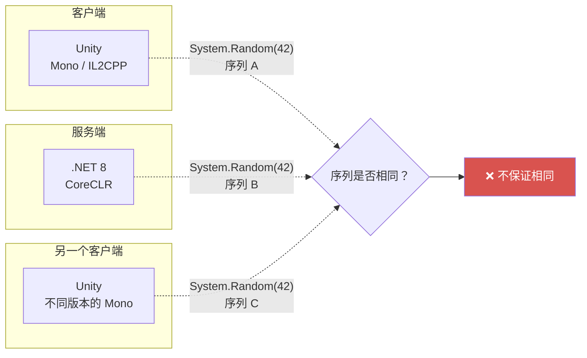
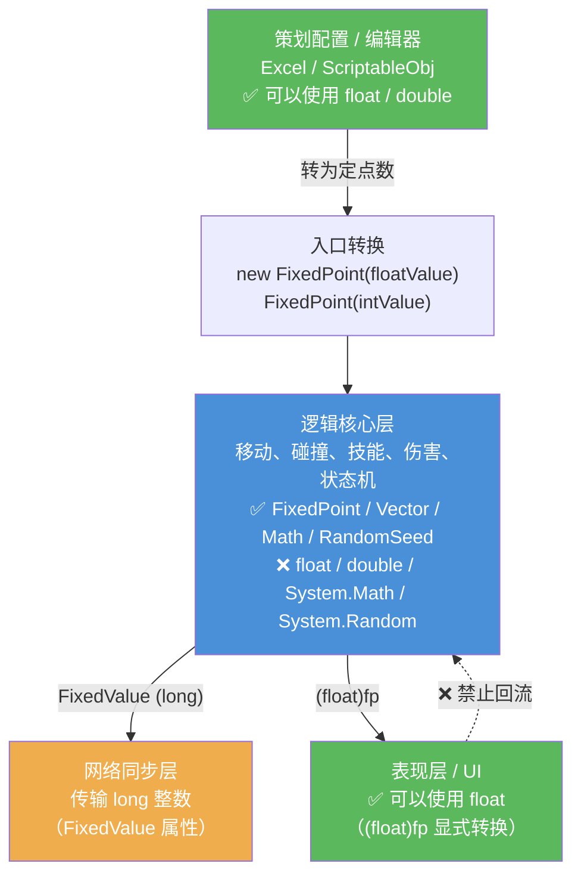

# 定点数实现原理

这篇文档描述 `Tao.FixedPoint` 库从零开始搭建的完整过程。  
重点不在如何调用 API（那部分请参考 `3.API快速参考.md`），而在于**每一步为什么这样设计、解决了什么问题**。

建议先阅读 `1.基础知识必备.md`，其中关于补码、移位运算的内容是本文的前置知识。

---

## 1. 起因：帧同步的确定性需求

### 1.1 帧同步对计算结果的要求

帧同步的核心架构是：每个客户端各自进行完整的逻辑模拟，只同步输入。也就是说 A 端和 B 端拿到相同的输入，独立计算，但结果必须**完全一致**——不是"差不多"，而是每一位都不能有差异。

为什么要这么严格？因为帧同步中每一帧的输出就是下一帧的输入。  
假设 A 端在某一帧计算出角色位置是 `(10.00001, 5)`，B 端计算出 `(9.99999, 5)`。  
单看差了 0.00002，似乎可以忽略。但下一帧拿这个位置继续计算碰撞、伤害、反弹角度……经过几百帧的累积放大，A 端的角色可能在地图左侧，B 端的角色在地图右侧。

在实际的帧同步项目中，这个问题的影响远比想象中严重。一次微小的计算偏差会在后续帧中持续放大，最终导致两端逻辑完全分叉——表现为角色瞬移、技能判定不一致、状态机走向不同等难以排查的问题。

### 1.2 浮点数为什么不能用

浮点数本身的精度并不差，问题在于**跨平台行为不一致**。

同一行代码 `float a = 0.1f + 0.2f;`，在不同环境下可能产生不同的结果：

- Intel CPU 和 ARM CPU 的浮点单元实现细节不同
- Windows 和 macOS 的 JIT 编译器生成的指令可能不一样
- 同一平台上 Debug 和 Release 编译的结果也可能不同（Release 优化可能使用更宽的寄存器）
- 部分编译器会调整浮点运算顺序，`(a+b)+c` 和 `a+(b+c)` 在浮点中可能给出不同的值

这些差异小到人眼无法察觉，但对帧同步而言是致命的。由于无法控制玩家使用什么设备和操作系统，只能从根本上保证逻辑层不依赖浮点运算。

### 1.3 解法：用整数运算

整数运算不存在跨平台一致性问题。`3 + 5` 在所有 CPU、所有编译器、所有操作系统上的结果都是 8，没有"取决于硬件实现"的情况。

因此思路很明确：**将逻辑层的所有计算建立在整数之上**。

但游戏逻辑中到处都有小数——速度 2.5、角度 45.7、坐标 123.456。如何用整数表示小数？

这就是定点数要解决的核心问题。

---

## 2. 定点数的核心思想

### 2.1 一句话概括

**将小数乘以一个固定的整数倍数，转换为整数进行存储和运算。**

### 2.2 类比：银行系统的"分"

银行系统中 `12.34 元` 不会以浮点数 `12.34` 存储，而是以整数 `1234 分` 存储。加减运算直接操作整数 `1234 + 567 = 1801`，显示时再除以 100 还原为"元"。

定点数的原理与此完全相同。区别仅在于：银行放大 100 倍（因为"分"是最小单位），而本库放大 1024 倍（因为 2 的幂方便用移位运算实现乘除）。

---

## 3. 第一步：选择定点格式

### 3.1 Q10 格式

Q 格式是工业界对定点数的标准命名方式。Q10 表示小数部分占 10 个二进制位，即放大倍数为 2¹⁰ = 1024。

```text
内部值 = 真实值 × 1024
真实值 = 内部值 ÷ 1024
```

具体示例：

```text
真实值  1.0   → 内部值  1024
真实值  1.5   → 内部值  1536    (1.5 × 1024)
真实值 -2.25  → 内部值 -2304   (-2.25 × 1024)
真实值  0.001 → 内部值  1       (四舍五入后的最小精度单位)
```

### 3.2 为什么选 Q10 而不是 Q16 或 Q8

这是一个精度与范围之间的权衡。

**Q16（放大 65536 倍）**：精度很高，但有效范围缩小。如果用 `int` 存储，有效范围仅有 ±32767，坐标稍大就会溢出。用 `long` 存储范围足够，但两个 Q16 值相乘时内部值会叠加两次 65536 的放大倍数，中间结果的溢出风险显著增大。

**Q8（放大 256 倍）**：范围大，但精度粗糙，最小精度约 0.004。例如角色移动速度 0.5 在 Q8 下只有 128 个离散档位，做平滑插值时可能出现明显的阶梯感。

选择 Q10 的原因是它在精度与范围之间取得了较好的平衡：

- 精度约 0.001（1/1024），对游戏逻辑中常见的数值（位置、速度、伤害等）足够
- 配合 `long` 存储，有效范围约 ±21 亿
- 1024 是 2 的幂，乘除法可以用移位代替，JIT 对此有很好的优化
- 查找表的采样密度与 1024 级精度配合良好

### 3.3 为什么用 long 而不是 int

`int` 为 32 位，在 Q10 下有效范围约 ±2,097,151（约 200 万）。

这个范围看起来不小，但在中间运算中很容易不够。两个定点数相乘时，内部值会叠加两次 1024 的放大倍数（乘完之后需要除掉一个 1024），中间乘积很容易超出 `int` 的范围。

`long` 为 64 位，Q10 下有效范围约 ±21 亿。中间运算也有充足的空间：`MAX_VALUE` 左移 10 位约为 2.25×10¹⁵，而 `long.MaxValue` 约为 9.2×10¹⁸，余量超过千倍。

选择 `long` 的另一个原因是：游戏逻辑中频繁出现 `a * b / c` 这类运算，中间乘积 `a * b` 可能非常大。使用 `int` 时乘法步骤很容易溢出，而 C# 中整数溢出默认不抛异常，只会静默回绕，导致难以排查的 bug。

---

## 4. 第二步：构建 FixedPoint 结构体

### 4.1 核心结构

整个 FixedPoint 的本质是对一个 `long` 值的封装：

```csharp
public struct FixedPoint
{
    // Q10 内部值：真实值乘以 1024 后的整数
    // 例如真实值 1.5 存为 1536，真实值 -0.5 存为 -512
    private readonly long _fixedValue;
}
```

围绕这个 `long` 值，对外暴露了几个只读属性：

```text
FixedValue   → 返回 _fixedValue 本身（用于底层运算或网络传输）
RawFloat     → _fixedValue / 1024.0，保留 3 位小数（用于 UI 显示）
RawInt       → 四舍五入到整数（用于 UI 显示）
```

### 4.2 构造函数设计

库提供了 4 种构造函数，语义各不相同，这一点需要特别注意：

| 写法 | 内部行为 | 使用场景 |
|---|---|---|
| `new FixedPoint(5)` | 将 5 左移 10 位，内部值 = 5120 | 日常逻辑编写，最常用 |
| `new FixedPoint(5L)` | 直接存储 5，不做任何变换 | 网络接收的原始值、底层运算 |
| `new FixedPoint(1.5f)` | round(1.5 × 1024) = 1536 | 从配置表加载浮点数据 |
| `new FixedPoint(1.5)` | 同上 | 从配置表加载浮点数据 |

其中 `int` 和 `long` 构造函数的区别是最常见的错误来源：

```csharp
// int 版本：参数被视为"真实值"，内部自动乘以 1024
new FixedPoint(5)     // 真实值 5.0 → 内部值 5120

// long 版本：参数被视为"已放大的内部值"，不做变换
new FixedPoint(5L)    // 内部值 5 → 真实值约 0.005
```

两者相差 1024 倍。从网络反序列化时，收到的 `long` 值必须使用 `long` 构造函数，否则结果会严重偏差。

### 4.3 饱和钳位（Saturate）

所有构造和运算的结果都会经过饱和钳位检查：

```csharp
/// <summary>
/// 将值钳位到 [MIN_VALUE, MAX_VALUE] 范围内。
/// 超出范围时返回边界值，而非让整数回绕。
/// </summary>
private static long Saturate(long value)
{
    if (value > MAX_VALUE)
    {
        return MAX_VALUE;
    }

    if (value < MIN_VALUE)
    {
        return MIN_VALUE;
    }

    return value;
}
```

`MAX_VALUE` 定义为 `int.MaxValue << 10`（约 2.2 × 10¹²），`MIN_VALUE` 为 `-MAX_VALUE`，正负完全对称。

C# 中 `long` 运算默认处于 `unchecked` 上下文，溢出不抛异常而是直接回绕——`long.MaxValue + 1` 会变成 `long.MinValue`，一个巨大的正数变为巨大的负数。饱和钳位保证了**即使运算结果超出范围，也不会出现符号翻转**，而是停留在边界值上。虽然结果不一定精确，但至少行为可预测，调试时能快速识别"这是溢出导致的截断"。

饱和钳位还带来一个重要的附带好处：因为 `MIN_VALUE` 是 `-MAX_VALUE`（而非 `long.MinValue`），`_fixedValue` 永远不会等于 `long.MinValue`。这意味着取反操作 `-_fixedValue` 始终安全——在补码中 `-long.MinValue` 会溢出（正数域无法容纳），但本库的值域不包含这个边界，因此 `Abs` 的实现不需要对 `long.MinValue` 做特殊处理。

### 4.4 类型转换：implicit 与 explicit 的选择

**int → FixedPoint：implicit（隐式）**

这是最高频的操作，语义明确——`FixedPoint hp = 100;` 一眼就能看出含义。如果每次都要写 `new FixedPoint(100)` 会让代码过于冗长。

**float/double → FixedPoint：explicit（显式）**

必须手动写 `(FixedPoint)3.14f`。浮点到定点是有损操作（精度会发生变化），而且在帧同步架构中这是一个"跨域"边界。`explicit` 强制开发者在代码中留下显式标记，让 reviewer 能够注意到此处进入了定点世界。

**FixedPoint → float/double/int：全部 explicit**

从定点世界回到浮点世界同样是跨域操作，必须显式声明。这样如果有人在核心逻辑中误写了 `float x = myFixedPoint;`，编译器会直接报错，而不是静默完成转换。

### 4.5 预计算常量

圆周率、角度弧度转换系数等数学常量，全部直接以 Q10 内部值定义：

```csharp
// Pi ≈ 3.14159 → round(3.14159 × 1024) = 3217
// 使用 long 构造函数，传入的是预先计算好的内部值
public static readonly FixedPoint Pi = new FixedPoint(3217L);
public static readonly FixedPoint TwoPi = new FixedPoint(6434L);
public static readonly FixedPoint PiOver2 = new FixedPoint(1609L);
```

不使用 `new FixedPoint(3.14159)` 的原因：后者在运行时会执行浮点乘法。虽然只在初始化时执行一次，影响很小，但既然这些值可以在编码阶段就确定，就没有必要让运行时接触浮点运算。

---

## 5. 第三步：四则运算

### 5.1 加减法

两个定点数相加，直接将内部值相加即可：

```text
a 的内部值 + b 的内部值 = (a + b) 的内部值

例：1.5 + 2.0
  1536 + 2048 = 3584
  3584 / 1024 = 3.5 ✓
```

放大倍数相同，加减法不改变倍数。结果经过 `Saturate` 防止溢出。

```csharp
public static FixedPoint operator +(FixedPoint a, FixedPoint b)
{
    // 两个操作数都是"×1024"后的值，和仍然是"×1024"，直接相加
    return new FixedPoint(Saturate(a._fixedValue + b._fixedValue));
}
```

### 5.2 乘法

两个定点值相乘时，放大倍数会叠加。用一个具体的例子来理解：

```text
计算 1.5 × 2.0：

  1.5 的内部值 = 1536（即 1.5 × 1024）
  2.0 的内部值 = 2048（即 2.0 × 1024）

  直接相乘：1536 × 2048 = 3,145,728

  但 3,145,728 / 1024 = 3072，真实值 3072 / 1024 = 3.0 ✓
  如果不除回来：3,145,728 / 1024 = 3072... 等等，这不是 3.0 的内部值吗？

  问题在于：3,145,728 = 3.0 × 1024 × 1024 = 3.0 × 1024²
  多了一个 1024，必须除掉一个才能还原为正确的 Q10 表示
```

用公式表示：

```text
(a × 1024) × (b × 1024) = a × b × 1024²
```

结果多了一个 1024，需要除回来：

```csharp
// 内部值相乘后多了一个 MULTIPLE（1024），需要缩回
return new FixedPoint(Saturate(av * bv / MULTIPLE));
```

这里有一个关键的设计选择：**为什么使用 `/ MULTIPLE`（整数除法）而非 `>> 10`（右移 10 位）？**

对正数来说两者等价，但对负数结果不同：

```text
整数除法：-1 / 1024 = 0     （向零截断）
右移：    -1 >> 10  = -1    （向负无穷截断）
```

来看一个具体的例子。`-0.001 * 0.5`（内部值为 `-1 × 512 = -512`）：

```text
用整数除法：-512 / 1024 = 0       真实值 0（精度不足，截断为 0）
用右移：    -512 >> 10  = -1      真实值 -0.001（向负无穷截断）
```

而 `0.001 * 0.5`（内部值为 `1 × 512 = 512`）：

```text
用整数除法：512 / 1024 = 0        真实值 0
用右移：    512 >> 10  = 0        真实值 0
```

使用整数除法时，正数路径和负数路径的截断行为是对称的（都向零截断）。而使用右移时，正数向零截断、负数向负无穷截断，两者不对称。为了保证运算的对称性，选择使用整数除法。

关于性能：JIT 编译器对正数路径会自动将除以 2 的幂优化为右移指令，不需要额外关注。

乘法还包含溢出检测逻辑：

```csharp
// 预检查 av * bv 是否会溢出 long
long absA = av > 0 ? av : -av;
long absB = bv > 0 ? bv : -bv;
if (absA > long.MaxValue / absB)
{
    // 中间乘积溢出 long → 按操作数符号返回饱和值
    return new FixedPoint((av ^ bv) >= 0 ? MAX_VALUE : MIN_VALUE);
}
```

如果中间乘积会溢出 `long`，直接根据符号返回 `MAX_VALUE` 或 `MIN_VALUE`，避免未定义行为。

### 5.3 除法

除法与乘法相反：不是除回一个倍数，而是先放大再除，以保留精度。

用一个具体的例子来理解为什么需要"先放大"：

```text
计算 1.0 / 3.0：

  1.0 的内部值 = 1024
  3.0 的内部值 = 3072

  如果直接除：1024 / 3072 = 0（整数除法截断了）
  结果是 0，但正确答案应该是 ≈ 0.333

  先放大再除：(1024 × 1024) / 3072 = 1048576 / 3072 = 341
  341 / 1024 = 0.333 ✓

  先乘以 1024 相当于多保留了 10 位二进制精度，
  这样除法的结果就不会被过早截断为 0
```

用公式表示：

```text
a / b = (a 的内部值 × 1024) / b 的内部值
```

如果直接用 `a._fixedValue / b._fixedValue`，结果会丢失小数部分。先将被除数左移 10 位再除，相当于多保留了 10 位精度：

```csharp
public static FixedPoint operator /(FixedPoint a, FixedPoint b)
{
    if (b._fixedValue == 0)
    {
        // 除零饱和：0/0 → 0，非零/0 → 按被除数符号饱和
        if (a._fixedValue == 0)
        {
            return Zero;
        }

        return new FixedPoint(a._fixedValue > 0 ? MAX_VALUE : MIN_VALUE);
    }

    long shifted = a._fixedValue << BIT_MOVE_COUNT;
    return new FixedPoint(Saturate(shifted / b._fixedValue));
}
```

两个设计要点：

**除零饱和。** 除数为零时不抛异常，而是返回饱和值。`0/0` 返回 `Zero`（数学上无定义，但 0 是最安全的默认值）；正数除以零返回 `MaxValue`，负数除以零返回 `MinValue`（模拟正负无穷的效果）。这样做的好处是游戏逻辑中不需要到处写 `if (divisor != 0)` 的防御代码，向量归一化零向量、Tan(π/2) 等场景都能自然处理。

**不会溢出。** `MAX_VALUE` 左移 10 位约为 2.25×10¹⁵，远小于 `long.MaxValue`（9.2×10¹⁸）。

### 5.4 取模

内部值直接执行 `%` 运算即可，不需要额外的缩放处理。与除法一样，取模也需要处理除数为零的情况：

```csharp
public static FixedPoint operator %(FixedPoint a, FixedPoint b)
{
    if (b._fixedValue == 0)
    {
        return Zero;
    }

    return new FixedPoint(a._fixedValue % b._fixedValue);
}
```

除数为零时直接返回 `Zero`，与除法的饱和策略保持一致——不抛异常，不让逻辑层因为一次意外的零值而崩溃。

为什么不需要像乘法那样做缩放修正？因为取模运算的结果与操作数的放大倍数保持一致。用一个例子来说明：

```text
计算 5.5 % 2.0：

  5.5 的内部值 = 5632（即 5.5 × 1024）
  2.0 的内部值 = 2048（即 2.0 × 1024）

  直接取模：5632 % 2048 = 1536
  1536 / 1024 = 1.5 ✓

验证：5.5 = 2 × 2.0 + 1.5，余数确实是 1.5
```

数学上，如果 `a = q × b + r`，两边同乘 1024 得 `a×1024 = q × b×1024 + r×1024`，说明内部值的余数正好等于真实值余数的 1024 倍——和其他运算的 Q10 表示完全一致。

### 5.5 移位

**右移**很简单，直接使用 C# 的 `>>` 运算符：

```csharp
public static FixedPoint operator >>(FixedPoint a, int count)
{
    return new FixedPoint(a._fixedValue >> count);
}
```

C# 中 `long` 的 `>>` 是算术右移，高位补符号位。右移 n 位相当于除以 2ⁿ，对正数和负数都能正确处理：

```text
右移 1 位示例（相当于除以 2）：

  真实值 6.0 → 内部值 6144
  6144 >> 1 = 3072 → 真实值 3.0 ✓

  真实值 -3.0 → 内部值 -3072
  -3072 >> 1 = -1536 → 真实值 -1.5 ✓（算术右移保持符号位）
```

**左移**则需要额外的溢出检测。左移 n 位相当于乘以 2ⁿ，很容易超出有效范围。更危险的是，`long` 的左移溢出不会抛异常，而是直接做位截断——一个大正数左移后可能变成负数（高位被截掉，符号位翻转），这比得到一个不太精确的结果要严重得多。

```csharp
public static FixedPoint operator <<(FixedPoint a, int count)
{
    long fixedValue = a._fixedValue;
    if (fixedValue == 0)
    {
        return a;
    }

    // 预检查：移位后是否会超出有效范围
    if (count >= 63
        || (fixedValue > 0 && fixedValue > MAX_VALUE >> count)
        || (fixedValue < 0 && fixedValue < MIN_VALUE >> count))
    {
        // 溢出 → 返回同符号的饱和值，而非让 long 回绕
        return new FixedPoint(fixedValue > 0 ? MAX_VALUE : MIN_VALUE);
    }

    return new FixedPoint(fixedValue << count);
}
```

溢出检测的思路：如果 `fixedValue > MAX_VALUE >> count`，说明 `fixedValue << count > MAX_VALUE`（反向移位来比较，避免先移位再判断——因为移位本身就可能已经溢出了）。`count >= 63` 单独处理，因为 `long` 只有 64 位，移 63 位以上必然溢出。

```text
溢出检测示例：

  真实值 1000000.0 → 内部值 1024000000
  尝试左移 2 位（× 4）：
    MAX_VALUE >> 2 = 2199023255552 >> 2 = 549755813888
    1024000000 < 549755813888 → 不溢出
    1024000000 << 2 = 4096000000 → 真实值 4000000.0 ✓

  真实值 2000000000.0 → 内部值 2048000000000
  尝试左移 1 位（× 2）：
    MAX_VALUE >> 1 = 2199023255552 >> 1 = 1099511627776
    2048000000000 > 1099511627776 → 会溢出！
    返回 MAX_VALUE（而非让结果变成一个不可预测的值）
```

### 5.6 比较

直接比较内部值即可。两个定点数使用相同的放大倍数，所以内部值的大小关系和真实值完全一致：

```csharp
public static bool operator >(FixedPoint a, FixedPoint b)  => a._fixedValue > b._fixedValue;
public static bool operator <(FixedPoint a, FixedPoint b)  => a._fixedValue < b._fixedValue;
public static bool operator >=(FixedPoint a, FixedPoint b) => a._fixedValue >= b._fixedValue;
public static bool operator <=(FixedPoint a, FixedPoint b) => a._fixedValue <= b._fixedValue;
public static bool operator ==(FixedPoint a, FixedPoint b) => a._fixedValue == b._fixedValue;
public static bool operator !=(FixedPoint a, FixedPoint b) => a._fixedValue != b._fixedValue;
```

```text
比较示例：

  1.5 > 1.0 ?
  → 1536 > 1024 → true ✓

  -2.0 < -1.0 ?
  → -2048 < -1024 → true ✓
```

这里没有浮点比较中的"精度陷阱"。浮点数中 `0.1 + 0.2 == 0.3` 为 `false` 是因为每个值都有不同的舍入误差。而定点数中 `1024 + 2048 == 3072` 永远为 `true`——整数比较没有任何歧义。

不过需要注意一个问题：定点数的相等比较是**严格相等**。如果两个运算路径因为截断顺序不同导致最低位差了 1，`==` 会返回 `false`。如果需要容差比较，可以使用 `Math.Approximately(a, b)`，它允许最多 1 个精度单位（约 0.001）的误差。

---

## 6. 第四步：基础数学函数

### 6.1 简单函数

`Abs`、`Min`、`Max`、`Sign`、`Clamp` 的逻辑都很直接。

值得说明的是 `Abs`：由于饱和钳位保证了 `_fixedValue` 永远不会等于 `long.MinValue`，取反操作始终安全，不需要像许多其他库那样对 `long.MinValue` 做特殊分支处理。

```csharp
public static FixedPoint Abs(FixedPoint value)
{
    if (value.FixedValue >= 0)
    {
        return value;
    }

    // 饱和钳位保证此处不会出现 long.MinValue，取反安全
    return new FixedPoint(-value.FixedValue);
}
```

### 6.2 取整函数

本库提供五个取整函数，它们的区别在于"往哪个方向靠"。先看一张对照表，建立直觉：

```text
真实值        Floor    Ceiling   Truncate   Round
 2.7          2        3         2          3
 2.3          2        3         2          2
-2.3         -3       -2        -2         -2
-2.7         -3       -2        -2         -3
```

Floor 向负无穷、Ceiling 向正无穷、Truncate 向零、Round 四舍五入。下面逐个说明实现方式。

#### Floor（向负无穷取整）

```csharp
internal const long FRAC_MASK = FixedPoint.MULTIPLE - 1;  // 0x3FF，低 10 位全 1

public static FixedPoint Floor(FixedPoint value)
{
    return new FixedPoint(value.FixedValue & ~FRAC_MASK);
}
```

Q10 格式下，内部值的低 10 位存的是小数部分，高位存的是整数部分。`FRAC_MASK` = 0x3FF = `0011 1111 1111`，刚好选中低 10 位。取反得到 `~FRAC_MASK`，低 10 位全 0、其余位全 1，跟内部值做 `&` 就能把小数部分清零，只留下整数部分。

先看正数的情况，`Floor(2.7)`：

```text
内部值 = 2765（2.7 × 1024 ≈ 2764.8，四舍五入）
拆分：2765 = 2 × 1024 + 717，整数 = 2，小数 = 717/1024 ≈ 0.700

二进制（| 为 Q10 分界线，左侧整数、右侧低 10 位小数）：

  原始：  10 | 10 1100 1101    = 2765
        整数=2   小数=717

  & ~0x3FF 清零低 10 位：

  结果：  10 | 00 0000 0000    = 2048
        整数=2   小数=0         → 2048 / 1024 = 2.0 ✓
```

正数没什么悬念，清零小数位就是向下取整。关键看负数，`Floor(-2.3)`：

```text
内部值 = -2355（-2.3 × 1024 ≈ -2355.2，四舍五入）
拆分：-2355 = (-3) × 1024 + 717，整数 = -3，小数 = 717
```

注意：`-2.3` 做 Floor 应该得到 `-3`（向负无穷方向），而不是 `-2`。

`& ~0x3FF` 清零低 10 位，本质上是减去小数部分：`-2355 - 717 = -3072`，而 `-3072 / 1024 = -3.0`，正好是 Floor 的结果。

这就是补码的妙处——清零小数位对正负数的效果是一致的：对于正数 2765，减去小数 717 得到 2048（变小了）；对于负数 -2355，减去小数 717 得到 -3072（也变小了，更负了）。两个方向都朝着负无穷走，恰好就是 Floor 的定义。不需要任何 if 分支，一次位与操作搞定。

#### Ceiling（向正无穷取整）

```csharp
public static FixedPoint Ceiling(FixedPoint value)
{
    long v = value.FixedValue;
    return (v & FRAC_MASK) == 0
        ? value                                              // 已经是整数，直接返回
        : new FixedPoint((v & ~FRAC_MASK) + FixedPoint.MULTIPLE);  // Floor + 1
}
```

思路很简单：先用 `v & FRAC_MASK` 检查是否存在小数部分（低 10 位是否有非零位）。如果没有小数，本身就是整数，直接返回。如果有小数，则先做 Floor（清零低位），再加一个 `MULTIPLE`（1024），相当于整数部分 +1。

```text
Ceiling(2.3)：
  内部值 = 2355
  低 10 位：2355 & 0x3FF = 307 ≠ 0 → 有小数
  Floor 部分：2355 & ~0x3FF = 2048
  加 MULTIPLE：2048 + 1024 = 3072
  3072 / 1024 = 3.0 ✓

Ceiling(-2.3)：
  内部值 = -2355
  低 10 位：-2355 & 0x3FF（补码下）≠ 0 → 有小数
  Floor 部分：-2355 & ~0x3FF = -3072
  加 MULTIPLE：-3072 + 1024 = -2048
  -2048 / 1024 = -2.0 ✓（向正无穷方向取整）
```

#### Truncate（向零取整）

```csharp
public static FixedPoint Truncate(FixedPoint value)
{
    return new FixedPoint(value.FixedValue / FixedPoint.MULTIPLE * FixedPoint.MULTIPLE);
}
```

利用 C# 整数除法"向零截断"的特性。先除以 1024 丢掉小数部分（整数除法自动截断），再乘回 1024 还原为 Q10 格式。

```text
Truncate(2.7)：
  内部值 = 2765
  2765 / 1024 = 2（向零截断）
  2 × 1024 = 2048 → 真实值 2.0 ✓

Truncate(-2.7)：
  内部值 = -2765
  -2765 / 1024 = -2（C# 整数除法向零截断，不是 -3）
  -2 × 1024 = -2048 → 真实值 -2.0 ✓
```

注意 Truncate 和 Floor 对负数的行为不同：`Truncate(-2.7) = -2`（向零），`Floor(-2.7) = -3`（向负无穷）。

#### Round（四舍五入）

```csharp
public static FixedPoint Round(FixedPoint value)
{
    long integerPart = value.FixedValue / FixedPoint.MULTIPLE;
    long remainder = value.FixedValue % FixedPoint.MULTIPLE;
    if (System.Math.Abs(remainder) * 2 >= FixedPoint.MULTIPLE)
    {
        integerPart += System.Math.Sign(remainder);
    }
    return new FixedPoint(integerPart * FixedPoint.MULTIPLE);
}
```

先用整数除法和取模分离出整数部分和小数部分。然后判断小数的绝对值是否 ≥ 0.5（即 `|remainder| × 2 ≥ 1024`），如果是则向远离零的方向进位。

```text
Round(2.7)：
  内部值 = 2765
  整数部分：2765 / 1024 = 2
  余数：2765 % 1024 = 717
  |717| × 2 = 1434 ≥ 1024 → 需要进位
  2 + Sign(717) = 2 + 1 = 3
  3 × 1024 = 3072 → 真实值 3.0 ✓

Round(-2.3)：
  内部值 = -2355
  整数部分：-2355 / 1024 = -2
  余数：-2355 % 1024 = -307
  |-307| × 2 = 614 < 1024 → 不进位
  -2 × 1024 = -2048 → 真实值 -2.0 ✓
```

这里 `System.Math.Abs` 和 `System.Math.Sign` 虽然调用了 `System.Math`，但它们操作的是整数（`long`），不涉及浮点运算，不影响跨平台确定性。

#### Fract（取小数部分）

```csharp
public static FixedPoint Fract(FixedPoint value)
{
    return value - Floor(value);
}
```

从原值中减去 Floor 的结果，剩下的就是小数部分。返回值始终在 [0, 1) 范围内（包括负数输入）：

```text
Fract(2.7) = 2.7 - Floor(2.7) = 2.7 - 2.0 = 0.7 ✓
Fract(-2.3) = -2.3 - Floor(-2.3) = -2.3 - (-3.0) = 0.7 ✓
```

负数返回 0.7 而非 -0.3，这与 GLSL 中 `fract()` 的行为一致。

### 6.3 平方根

平方根是向量归一化、距离计算等操作的基础，调用频率很高，实现上需要兼顾精度和效率。本库使用牛顿迭代法（也叫巴比伦法），分三步完成：输入校验、初始值估算、迭代逼近。

#### 问题转化

我们要求的是 `√x`，但操作的是 Q10 内部值 `v = x × 1024`。需要搞清楚：对内部值 `v` 做完平方根运算后，结果应该是什么形式？

```text
设 r = √x，则 r 的 Q10 内部值 = r × 1024 = √x × 1024

而我们手上只有 v = x × 1024，所以：
  r × 1024 = √x × 1024
           = √(v / 1024) × 1024
           = √v × √1024
           = √v × 32（近似）

或者换一种推导：
  r × 1024 = √(v × 1024)  ← 即 √(v × MULTIPLE)
```

所以在内部值层面，我们实际上要计算 `√(v × 1024)`。这就是为什么迭代公式中会出现 `v * MULTIPLE`——它把 `v` 还原为 `x × 1024²`，开方后得到 `√x × 1024`，正好是 Q10 格式的结果。

#### 初始值估算

牛顿法能不能快速收敛，取决于起点选得好不好。起点偏离真实答案 100 倍，就得迭代很多次；偏离 2 倍以内，几次就收敛了。

怎么快速估算一个数的平方根？利用二进制的位长度。一个 n 位的二进制数，大小在 `[2^(n-1), 2^n)` 范围内，量级约等于 `2^n`。那它的平方根就大约是 `2^(n/2)`。

前面推导过，Sqrt 在内部值层面实际要算的是 `√(v × 1024)`。`v` 占 `bits` 位，乘以 1024（2^10）后变成 `bits + 10` 位，所以 `√(v × 1024) ≈ 2^((bits + 10) / 2)`。代码里直接左移就得到这个估值：

```csharp
long v = value.FixedValue;

// 数一下 v 有几位二进制
int bits = 0;
long temp = v;
while (temp > 0)
{
    bits++;
    temp >>= 1;
}

// v 占 bits 位，v × MULTIPLE 占 bits + 10 位
// √(v × MULTIPLE) ≈ 2^((bits + 10) / 2)
long estimate = 1L << ((bits + FixedPoint.BIT_MOVE_COUNT) / 2);
```

用 `√9.0` 来验证估算有多准：

```text
v = 9216（真实值 9.0 的 Q10 内部值）
要算的目标：√(9216 × 1024) = √9437184 = 3072（即 3.0 × 1024）

9216 的二进制：10 0100 0000 0000 → 14 位
estimate = 2^((14 + 10) / 2) = 2^12 = 4096

估算值 4096 vs 真实值 3072，偏差约 1.33 倍
```

不管输入什么值，位长度估算的偏差始终在 2 倍以内——因为位长度锁定了数量级，误差最多差半个 bit 的量级。对牛顿法来说，这已经是一个足够好的起点。

#### 牛顿迭代

求 `√S` 等价于求方程 `f(e) = e² - S = 0` 的正根。牛顿法的迭代公式为：

```text
e(n+1) = e(n) - f(e(n)) / f'(e(n))
       = e(n) - (e(n)² - S) / (2·e(n))
       = (e(n) + S / e(n)) / 2
```

在 Q10 定点数中，`S = v × MULTIPLE`，因此迭代公式变为：

```csharp
for (int i = 0; i < 8; i++)
{
    estimate = (estimate + v * FixedPoint.MULTIPLE / estimate) >> 1;
}
```

`>> 1` 就是除以 2。每次迭代把当前估值和"修正值"取平均——如果估值偏大，`S / e` 就偏小，平均后就往正确值靠拢；反之亦然。

用 `√9.0` 跟踪一轮完整的迭代过程：

```text
初始 estimate = 4096

第 1 次: (4096 + 9216 × 1024 / 4096) / 2
       = (4096 + 9437184 / 4096) / 2
       = (4096 + 2304) / 2
       = 3200

第 2 次: (3200 + 9437184 / 3200) / 2
       = (3200 + 2949) / 2
       = 3074

第 3 次: (3074 + 9437184 / 3074) / 2
       = (3074 + 3069) / 2
       = 3071

第 4 次: (3071 + 9437184 / 3071) / 2
       = (3071 + 3072) / 2
       = 3071

后续迭代 estimate 不再变化，已经收敛。
3071 / 1024 ≈ 2.999 ≈ 3.0 ✓
```

可以看到第 2 次迭代就已经非常接近答案了，后续几次只是在最后 1-2 位上微调。这就是牛顿法"二次收敛"的特性——每次迭代有效精度位数翻倍（1→2→4→8→16 位）。Q10 精度只需要 10 位，所以理论上 4 次迭代就足够了，固定 8 次是为了留出充裕的安全余量。

#### 为什么固定 8 次而不用动态判断

可以在每次迭代后检查 `|e(n+1) - e(n)| < threshold`，提前退出。但条件分支在性能敏感的代码中并不划算——分支预测失败的代价往往比多做几次乘除更高。而且固定次数使得执行路径完全确定，在帧同步场景中，这种确定性比节省几次运算更重要。

### 6.4 幂运算

#### 整数指数：快速幂

`Pow(value, int)` 使用快速幂算法（也叫二进制取幂）。朴素的循环乘法需要 n 次乘法，而快速幂只需要 O(log n) 次。

```csharp
public static FixedPoint Pow(FixedPoint value, int exponent)
{
    if (exponent == 0)
    {
        return FixedPoint.One;
    }

    if (exponent == 1)
    {
        return value;
    }

    if (exponent < 0)
    {
        return FixedPoint.One / Pow(value, -exponent);
    }

    FixedPoint half = Pow(value, exponent >> 1);
    return (exponent & 1) == 1 ? value * half * half : half * half;
}
```

核心思路是递归地将指数二分：`x^10 = x^5 × x^5`，`x^5 = x × x^2 × x^2`。每次递归只做一两次乘法，而指数每次减半。

```text
计算 2.0^10：
  Pow(2, 10)
  = Pow(2, 5) × Pow(2, 5)                 ← 10 是偶数，half × half
  = (2 × Pow(2, 2) × Pow(2, 2)) ^ 2       ← 5 是奇数，value × half × half
  = (2 × (Pow(2, 1) × Pow(2, 1)) × ...) ^ 2
  总共只需要 4 次乘法，而非 9 次
```

负指数则先计算正指数的结果，再取倒数：`x^(-n) = 1 / x^n`。

#### 定点指数：指数-对数转换

`Pow(value, FixedPoint)` 处理非整数指数的情况，比如 `2.5^1.7`。这种运算无法通过简单的循环乘法完成。

利用数学恒等式 `b^e = e^(e × ln(b))` 进行转换：

```csharp
public static FixedPoint Pow(FixedPoint value, FixedPoint exponent)
{
    if (value <= FixedPoint.Zero)
    {
        throw new ArgumentOutOfRangeException(nameof(value), "定点指数幂的底数必须为正");
    }

    return Exp(exponent * Ln(value));
}
```

底数必须为正，因为负数的非整数次幂在实数范围内没有定义（`(-2)^0.5` 是虚数）。

### 6.5 对数与指数

#### Log2：迭代平方法

以 2 为底的对数是所有对数函数的基础。算法分两步：求整数部分和求小数部分。

```csharp
public static FixedPoint Log2(FixedPoint value)
{
    // 第一步：归一化到 [1.0, 2.0)，记录移位次数作为整数部分
    long normalizedValue = value.FixedValue;
    int integerPart = 0;
    while (normalizedValue >= 2 * FixedPoint.MULTIPLE)
    {
        normalizedValue >>= 1;
        integerPart++;
    }
    while (normalizedValue < FixedPoint.MULTIPLE)
    {
        normalizedValue <<= 1;
        integerPart--;
    }

    // 第二步：迭代平方法逐位求小数部分
    long fractionalBits = 0;
    for (int i = 0; i < FixedPoint.BIT_MOVE_COUNT; i++)
    {
        normalizedValue = normalizedValue * normalizedValue / FixedPoint.MULTIPLE;
        fractionalBits <<= 1;
        if (normalizedValue >= 2 * FixedPoint.MULTIPLE)
        {
            normalizedValue >>= 1;
            fractionalBits |= 1;
        }
    }

    return new FixedPoint((long)integerPart * FixedPoint.MULTIPLE + fractionalBits);
}
```

**整数部分**比较直观：不断右移（除以 2）直到值落入 [1.0, 2.0)，移了几次就说明 log2 的整数部分是几。比如 `log2(8) = 3`，8 需要右移 3 次才落入 [1, 2)。

**小数部分**使用"迭代平方法"，这个方法的核心思路值得展开说明。将归一化后的值设为 `x`（在 [1.0, 2.0) 内），我们要求 `log2(x)` 的小数部分，即一个 0 到 1 之间的值。

每次迭代执行以下操作：将 `x` 平方，检查结果是否 ≥ 2。如果 ≥ 2，说明当前这一位是 1（类似二分搜索中"走右边"），将结果除以 2 拉回 [1, 2)；否则这一位是 0。

```text
求 log2(3.0) 的过程：

整数部分：
  3.0 的内部值 = 3072
  3072 ≥ 2 × 1024 → 右移一次，integerPart = 1
  1536 在 [1024, 2048) 范围内 → 停止
  整数部分 = 1（因为 log2(3) ≈ 1.585，整数部分确实是 1）

小数部分（从 normalizedValue = 1536 开始，即 1.5）：
  第 1 轮: 1536² / 1024 = 2304 ≥ 2048 → bit=1, normalizedValue = 2304/2 = 1152
  第 2 轮: 1152² / 1024 = 1296 < 2048  → bit=0
  第 3 轮: 1296² / 1024 = 1640 < 2048  → bit=0
  ...
  逐位累积得到 fractionalBits ≈ 599

最终结果: 1 × 1024 + 599 = 1623
1623 / 1024 = 1.585 ≈ log2(3) ✓
```

#### Ln 和 Log10：换底公式

有了 Log2，自然对数和常用对数只需一次乘法：

```csharp
public static FixedPoint Ln(FixedPoint value)
{
    return Log2(value) * Ln2;     // Ln2 = ln(2) ≈ 0.693，内部值 710
}

public static FixedPoint Log10(FixedPoint value)
{
    return Log2(value) * Log10Of2; // Log10Of2 = log10(2) ≈ 0.301，内部值 308
}
```

这就是换底公式 `logₐ(x) = log₂(x) × logₐ(2)` 的直接应用。

#### Exp：范围约缩 + Taylor 展开

`e^x` 的实现分两步：先把输入拆成"好算的部分"和"小余数"，再分别处理。

```csharp
public static FixedPoint Exp(FixedPoint value)
{
    // 第一步：范围约缩
    // 将 x 分解为 k × ln(2) + r，其中 |r| ≤ ln(2)/2 ≈ 0.347
    long shiftCount = (inputRaw + halfLn2) / LN2_RAW;  // k = round(x / ln2)
    FixedPoint remainder = new FixedPoint(inputRaw - shiftCount * LN2_RAW);

    // 第二步：用五阶 Taylor 展开计算 e^r（r 很小，展开收敛很快）
    // Horner 形式: 1 + r(1 + r/2(1 + r/3(1 + r/4(1 + r/5))))
    FixedPoint taylorResult = FixedPoint.One + remainder / Five;
    taylorResult = FixedPoint.One + remainder * taylorResult / Four;
    taylorResult = FixedPoint.One + remainder * taylorResult / Three;
    taylorResult = FixedPoint.One + remainder * taylorResult / FixedPoint.Two;
    taylorResult = FixedPoint.One + remainder * taylorResult;

    // 第三步：e^x = e^r × 2^k，乘以 2^k 用移位实现
    return new FixedPoint(taylorResult.FixedValue << (int)shiftCount);
}
```

为什么要做范围约缩？因为 Taylor 展开 `e^x ≈ 1 + x + x²/2 + x³/6 + ...` 只在 `x` 接近 0 时收敛快。如果直接对 `x = 10` 做展开，需要几十阶才够精度。而约缩后 `|r| < 0.347`，五阶展开的误差已经在 Q10 精度之内。

范围约缩利用了恒等式 `e^x = e^(k·ln2 + r) = 2^k × e^r`。`2^k` 不需要计算，直接左移 `k` 位就行——这也是为什么选择按 `ln(2)` 来分解而非按其他常数。

```text
计算 e^2.0（预期 ≈ 7.389）：

范围约缩：
  x = 2048（2.0 × 1024）
  k = round(2048 / 710) = round(2.884) = 3
  r = 2048 - 3 × 710 = -82 → 真实值 -0.08

Taylor 展开 e^(-0.08)：
  ≈ 1 + (-0.08) + 0.0032 - 0.00009 + ...
  ≈ 0.923

乘以 2^3 = 8：
  0.923 × 8 = 7.384 ≈ 7.389 ✓
```

---

## 7. 第五步：三角函数

### 7.1 为什么不使用 System.Math

`System.Math.Sin`/`Cos`/`Acos` 全部是浮点实现，底层调用 C 运行时库或 CPU 的 FPU 指令。不同平台上可能给出微小不同的结果，不满足帧同步的确定性要求。

### 7.2 查找表方案

核心思路：**在离线阶段预先计算好函数值存入数组，运行时只做查表和插值**。

本库使用三张查找表：

| 表 | 用途 |
|---|---|
| `SinCosLookupTable` | 正弦和余弦（两张表一起存储） |
| `AcosLookupTable` | 反余弦 |
| `Atan2LookupTable` | 四象限反正切 |

### 7.3 Sin/Cos 的查表流程

以 Sin 为例，完整流程：


图中标红的"角度归约"步骤是一个关键的安全措施（下面会详细解释）。

各步骤的说明：

1. 传入一个弧度值（定点数内部值）。
2. **角度归约**：对 2π 取模，将弧度限制在 [0, 2π) 范围内。sin 是周期函数，sin(x) = sin(x mod 2π)，归约不影响结果。
3. **映射为表索引**：将归约后的弧度按比例映射到查找表的索引范围（表有固定大小）。
4. **查表 + 线性插值**：取出 `table[index]` 和 `table[index+1]`，根据余数做线性插值。
5. 将结果还原为定点值返回。

其中第 2 步的角度归约是一个关键的安全措施。原因在于：第 3 步映射索引时需要将弧度值乘以一个较大的系数（`NomMul = 40960000`）。如果传入的弧度值本身很大（例如角色旋转了上万圈），乘以 4000 万后中间结果会溢出 `long`。

先对 2π 取模将弧度限制在 [0, 6.28) 范围内，乘以 NomMul 后约为 2.5 × 10⁸，距 `long.MaxValue` 还有极大的余量。

这个归约步骤在三个地方都做了实现：`InterpolateTable()`、`SinCos()` 和 `SinCosLookupTable.GetIndex()`。

以下是 `InterpolateTable` 的完整实现：

```csharp
private static long InterpolateTable(int[] table, long numerator)
{
    // 归约到 [0, TRIG_TABLE_PERIOD)
    numerator %= TRIG_TABLE_PERIOD;
    if (numerator < 0) numerator += TRIG_TABLE_PERIOD;

    // 映射到表索引空间
    numerator *= SinCosLookupTable.NomMul;

    long tableIndex = numerator / TRIG_TABLE_PERIOD;
    long interpolationRemainder = numerator - tableIndex * TRIG_TABLE_PERIOD;

    int currentIndex = (int)tableIndex & SinCosLookupTable.Mask;
    int nextIndex = (currentIndex + 1) & SinCosLookupTable.Mask;

    // 线性插值: table[i] + (table[i+1] − table[i]) × remainder / period
    return table[currentIndex]
        + ((long)table[nextIndex] - table[currentIndex])
          * interpolationRemainder / TRIG_TABLE_PERIOD;
}
```

线性插值的作用是消除表的量化误差。查找表的精度取决于表的大小，索引往往无法精确命中某个弧度值，实际输入会落在两个表项之间。通过在 `table[i]` 和 `table[i+1]` 之间按余数比例做插值，相当于在两个采样点之间画了一条直线，大幅减小了量化带来的阶梯状误差。

### 7.4 SinCos 联合计算

游戏中经常同时需要 sin 和 cos（例如旋转向量时），分别调用 `Sin` 和 `Cos` 会重复执行角度归约和索引映射。`SinCos` 将两者合并：

```csharp
public static void SinCos(FixedPoint radians, out FixedPoint sin, out FixedPoint cos)
{
    // 归约 + 索引映射只做一次
    long scaledRadians = radians.FixedValue % TRIG_TABLE_PERIOD;
    if (scaledRadians < 0) scaledRadians += TRIG_TABLE_PERIOD;
    scaledRadians *= SinCosLookupTable.NomMul;

    long tableIndex = scaledRadians / TRIG_TABLE_PERIOD;
    long interpolationRemainder = scaledRadians - tableIndex * TRIG_TABLE_PERIOD;

    int currentIndex = (int)tableIndex & SinCosLookupTable.Mask;
    int nextIndex = (currentIndex + 1) & SinCosLookupTable.Mask;

    // 用同一个索引同时查 SinTable 和 CosTable
    long sinValue = SinCosLookupTable.SinTable[currentIndex]
        + ((long)SinCosLookupTable.SinTable[nextIndex]
           - SinCosLookupTable.SinTable[currentIndex])
          * interpolationRemainder / TRIG_TABLE_PERIOD;

    long cosValue = SinCosLookupTable.CosTable[currentIndex]
        + ((long)SinCosLookupTable.CosTable[nextIndex]
           - SinCosLookupTable.CosTable[currentIndex])
          * interpolationRemainder / TRIG_TABLE_PERIOD;

    sin = new FixedPoint(Divide(sinValue * FixedPoint.MULTIPLE, LOOKUP_FACTOR));
    cos = new FixedPoint(Divide(cosValue * FixedPoint.MULTIPLE, LOOKUP_FACTOR));
}
```

SinTable 和 CosTable 存储在同一个类中，使用相同大小和相同的索引空间，因此共享一次索引计算即可同时得到两个结果。

### 7.5 Acos 的查表流程

Acos 的输入定义域为 [-1, 1]，输出为 [0, π]。查表思路与 Sin/Cos 类似，但索引映射方式不同——Sin/Cos 的输入是弧度（范围很大，需要归约），而 Acos 的输入是比值（范围固定在 [-1, 1]）。

```csharp
private static FixedPoint AcosInterpolated(long scaledNumerator, long divisor)
{
    // 向下取整除法确定基准索引
    long q = scaledNumerator / divisor;
    long r = scaledNumerator - q * divisor;
    if (r < 0) { q--; r += divisor; }

    int rawIndex = (int)q + AcosLookupTable.HalfCount;

    // 边界外直接返回端点值
    if (rawIndex < 0)
        return new FixedPoint(
            Divide((long)AcosLookupTable.Table[0] * FixedPoint.MULTIPLE, LOOKUP_FACTOR));
    if (rawIndex >= AcosLookupTable.Count)
        return new FixedPoint(
            Divide((long)AcosLookupTable.Table[AcosLookupTable.Count] * FixedPoint.MULTIPLE,
                LOOKUP_FACTOR));

    // 线性插值
    long val0 = AcosLookupTable.Table[rawIndex];
    long val1 = AcosLookupTable.Table[rawIndex + 1];
    long interpolated = val0 + (val1 - val0) * r / divisor;

    return new FixedPoint(
        Divide(interpolated * FixedPoint.MULTIPLE, LOOKUP_FACTOR));
}
```

索引映射的关键在于 `HalfCount`：输入 -1 对应索引 0，输入 0 对应索引 `HalfCount`（表的中间），输入 +1 对应表末尾。这样 [-1, 1] 的整个定义域被均匀映射到整张表上。

Acos 与 Sin/Cos 使用相同的精度因子（`LOOKUP_FACTOR = 10000`）和相同的插值方式（线性插值），确保在 `Acos(Cos(x))` 这类组合调用中，两者的精度匹配，不会因为一侧精度高另一侧精度低而放大误差。

### 7.6 Atan2 的查表流程

`Atan2(y, x)` 计算向量 (x, y) 对应的角度，值域为 (-π, π]。这个函数在游戏中非常常用——敌人朝向、子弹飞行角度、摇杆方向等都需要它。

与 Sin/Cos 的一维查找表不同，Atan2 使用的是**二维查找表**（`Atan2LookupTable.Table`），因为它的结果同时取决于 x 和 y 两个分量。

实现流程分三步：

**第一步：象限映射。** 通过 x、y 的符号判断所在象限，将坐标映射到第一象限（x ≥ 0, y ≥ 0）。同时记录一个符号系数和角度偏移量，用于最后还原：

```csharp
if (absX < 0)
{
    if (absY < 0)
    {
        absX = -absX; absY = -absY;    // 第三象限 → 第一象限
        signMultiplier = 1;
    }
    else
    {
        absX = -absX;                   // 第二象限 → 第一象限
        signMultiplier = -1;
    }
    angleOffset = -31416;               // -π × 10000
}
```

**第二步：双线性插值查表。** 将 (absX, absY) 归一化到查找表索引范围 [0, dim-1]，在相邻四个表项之间做双线性插值。

为什么 Atan2 需要**双线性插值**而 Sin/Cos 只需要一维线性插值？因为 Sin/Cos 的查找表是一维的（输入一个弧度 → 输出一个值），输入落在两个采样点之间，沿着一条线插值就够了。而 Atan2 的查找表是二维的（输入 x 和 y 两个分量 → 输出一个角度），输入落在四个采样点围成的格子中间，需要沿两个方向分别插值——这就是"双线性"的含义。

具体实现：

```csharp
long maxComponent = absX >= absY ? absX : absY;

// 计算索引的整数部分和小数余数
long scaledX = absX * indexRange;
long scaledY = absY * indexRange;
int intX = (int)(scaledX / maxComponent);
int intY = (int)(scaledY / maxComponent);

// 余数缩放到 [0, MULTIPLE) 作为插值权重
long fracX = (scaledX - (long)intX * maxComponent) * FixedPoint.MULTIPLE / maxComponent;
long fracY = (scaledY - (long)intY * maxComponent) * FixedPoint.MULTIPLE / maxComponent;

// 相邻索引（边界处 frac == 0，插值自然退化为点采样）
int nextX = intX < (int)indexRange ? intX + 1 : intX;
int nextY = intY < (int)indexRange ? intY + 1 : intY;

// 四角查表
long t00 = Atan2LookupTable.Table[intY  * tableDimension + intX];
long t10 = Atan2LookupTable.Table[intY  * tableDimension + nextX];
long t01 = Atan2LookupTable.Table[nextY * tableDimension + intX];
long t11 = Atan2LookupTable.Table[nextY * tableDimension + nextX];

// 先沿 X 方向插值两行，再沿 Y 方向插值结果
long row0 = t00 + (t10 - t00) * fracX / FixedPoint.MULTIPLE;
long row1 = t01 + (t11 - t01) * fracX / FixedPoint.MULTIPLE;
long lookupAngle = row0 + (row1 - row0) * fracY / FixedPoint.MULTIPLE;
```

归一化时以较大的分量为基准（`maxComponent`），保证索引不越界，同时最大限度利用表的精度。

插值过程可以用一张示意图来理解：

```text
       intX        nextX
        │            │
intY  ──┼── t00 ─────┼── t10 ──    ← row0 = 沿 X 插值
        │     ·      │
        │      ·(fracX, fracY)      ← 实际输入落在这里
        │            │
nextY ──┼── t01 ─────┼── t11 ──    ← row1 = 沿 X 插值
        │            │

最终结果 = 在 row0 和 row1 之间沿 Y 插值
```

当 `fracX` 或 `fracY` 为 0 时（输入恰好落在表格线上），插值自然退化为对应的一维插值或直接查表，不需要额外的边界判断。

**第三步：还原象限。** 将查表得到的第一象限角度，根据之前记录的符号和偏移量还原为实际象限的角度。

---

## 8. 第六步：插值与角度工具

### 8.1 插值函数

#### Lerp（线性插值）

```csharp
public static FixedPoint Lerp(FixedPoint a, FixedPoint b, FixedPoint t)
{
    t = Clamp01(t);
    return a + (b - a) * t;
}
```

`Lerp(a, b, t)` 返回 a 和 b 之间按 t 比例混合的值。`t = 0` 返回 a，`t = 1` 返回 b，`t = 0.5` 返回中点。t 会被钳制到 [0, 1]，不用担心传入越界的值。`LerpUnclamped` 则跳过钳制，允许外推。

```text
Lerp(0, 100, 0.3)：
  0 + (100 - 0) × 0.3 = 30 ✓
```

#### InverseLerp（反向线性插值）

`Lerp` 的逆操作——已知 a、b 和结果值，求 t：

```csharp
public static FixedPoint InverseLerp(FixedPoint a, FixedPoint b, FixedPoint value)
{
    if (a != b)
    {
        return Clamp01((value - a) / (b - a));
    }
    return FixedPoint.Zero;
}
```

```text
InverseLerp(0, 100, 30) = (30 - 0) / (100 - 0) = 0.3 ✓
```

典型用途是计算进度条：血量从 0 到 maxHp，当前 currentHp 对应进度条的百分比。

#### MoveTowards（匀速逼近）

```csharp
public static FixedPoint MoveTowards(FixedPoint current, FixedPoint target, FixedPoint maxDelta)
{
    if (Abs(target - current) <= maxDelta)
    {
        return target;
    }
    return current + Sign(target - current) * maxDelta;
}
```

每帧调用时，current 向 target 移动最多 maxDelta 距离。到达后精确停在 target 上，不会越过。适合需要匀速移动到目标值的场景（例如 MOBA 中转向角度渐变）。

#### SmoothStep（Hermite 曲线插值）

```csharp
public static FixedPoint SmoothStep(FixedPoint from, FixedPoint to, FixedPoint t)
{
    t = Clamp01(t);
    t = t * t * (Three - FixedPoint.Two * t);   // Hermite 多项式 3t² - 2t³
    return from + (to - from) * t;
}
```

与 Lerp 类似，但插值曲线不是直线而是 S 形——起步慢、中间快、到达时减速。`3t² - 2t³` 是经典的 Hermite 平滑曲线，在 t=0 和 t=1 处导数为 0，产生自然的缓入缓出效果。

#### SmoothDamp（弹簧阻尼平滑）

`SmoothDamp` 模拟弹簧阻尼系统，让值平滑地趋向目标，到达时自然停下而非突然刹车。相机跟随是最典型的使用场景。

这个函数的 `deltaTime` 参数**必须传入固定步长**（例如 `new FixedPoint(16)` 表示 16ms 的帧同步步长）。绝不能传入 `Time.deltaTime` 之类的浮点帧时间——帧同步本身就是定步长驱动的，这个值应该是常量。

### 8.2 角度工具

游戏中处理角度有一个经典的坑：359° 和 1° 之间差多少度？直接做差得到 `1 - 359 = -358`，但角度是环形的，实际最短路径只有 2°。

`DeltaAngle` 利用 `Repeat` 函数处理回绕：

```csharp
public static FixedPoint DeltaAngle(FixedPoint current, FixedPoint target)
{
    FixedPoint delta = Repeat(target - current, Deg360);
    if (delta > Deg180)
    {
        delta -= Deg360;
    }
    return delta;
}
```

`Repeat(x, 360)` 等效于 `x mod 360`，但保证结果在 [0, 360) 范围内（负数也会被映射到正数区间）。然后检查 delta 是否超过 180°——如果超过，说明"走另一边更近"，减去 360° 翻转方向。

```text
DeltaAngle(359, 1)：
  target - current = 1 - 359 = -358
  Repeat(-358, 360) = 2      ← -358 + 360 = 2
  2 < 180 → 不修正
  结果: 2° ✓（从 359° 顺时针转 2° 到 1°）

DeltaAngle(10, 350)：
  target - current = 350 - 10 = 340
  Repeat(340, 360) = 340
  340 > 180 → 340 - 360 = -20
  结果: -20° ✓（从 10° 逆时针转 20° 到 350°）
```

`LerpAngle` 和 `MoveTowardsAngle` 内部也使用了同样的回绕处理，确保角度插值走最短路径。

角度弧度转换提供两种方式：

- **常量乘法**：`degrees * Deg2Rad`——速度快，但常量精度有限（Deg2Rad ≈ 0.0176，Q10 下的内部值仅为 18，意味着最多只有 1-2 位有效精度）。
- **方法调用**：`DegreesToRadians(degrees)` 精度更高。下面详细说明它的实现原理。

#### 为什么分步运算会丢精度

如果直接用定点数运算符计算 `degrees * Pi / Deg180`，实际上发生了两步：

```
第 1 步：乘法  →  degrees.FV × Pi.FV / 1024    （截断一次）
第 2 步：除法  →  中间结果 × 1024 / Deg180.FV   （截断一次）
```

两次截断各丢掉一点小数尾巴，累积起来就可能让最终结果偏差 1 个 Q10 单位。以 90° 为例：

```
第 1 步：92160 × 3217 / 1024 = 296478720 / 1024 = 289530（截断）
第 2 步：289530 × 1024 / 184320 = 296478720 / 184320 = 1608（截断）
```

得到 1608，但 π/2 的 Q10 精确表示应为 1609（即库中 `PiOver2` 常量的值）。差了 1 个单位，导致 `Cos(90°)` 不是精确的 0 而是 1。

#### 单次四舍五入除法如何解决

把两步运算合并为一步：直接用原始内部值相乘，只做一次除法，并且在除法前加上半个除数实现四舍五入：

```csharp
public static FixedPoint DegreesToRadians(FixedPoint degrees)
{
    // num（分子）：角度的内部值 × π 的内部值，得到一个"未缩放"的大整数
    // 数学含义：degrees × π，但保留了全部精度，不做任何中间截断
    long num  = degrees.FixedValue * FixedPoint.Pi.FixedValue;

    // den（分母）：180° 对应的定点数内部值 = 180 × 1024 = 184320
    // num / den 的含义就是 degrees × π / 180，即角度转弧度的公式
    long den  = Deg180.FixedValue;

    // half（半个分母）：用于在除法前实现四舍五入
    long half = den >> 1;

    // 正数加 half，负数减 half，保证四舍五入始终远离零
    return new FixedPoint(num >= 0 ? (num + half) / den : (num - half) / den);
}
```

**为什么加 `half` 就能四舍五入？**

C# 整数除法默认"向零截断"——直接砍掉小数部分。比如 `7 / 2 = 3`（真实值 3.5，截断后得 3）。

如果我们希望四舍五入（3.5 应该进位到 4），只需在除之前**加上除数的一半**：`(7 + 1) / 2 = 8 / 2 = 4`。这就是 `half` 的作用。

通用规则：对于 `num / den`——
- 余数 < den/2（即小数部分 < 0.5）：加了 `half` 后仍不够进位，结果和截断相同
- 余数 ≥ den/2（即小数部分 ≥ 0.5）：加了 `half` 后刚好够进位，自动向上取整

**为什么负数要减 `half` 而不是加？**

因为四舍五入是"远离零"。对正数 3.5 → 4（往大了走），对负数 -3.5 → -4（往小了走）。C# 整数除法对负数也是向零截断（`-7 / 2 = -3`），所以负数需要反方向补偿：`(-7 - 1) / 2 = -8 / 2 = -4`。

**仍以 90° 为例，代入具体数值：**

```
new FixedPoint(90).FixedValue = 92160     // 90 × 1024
Pi.FixedValue                 = 3217      // π ≈ 3.14159 的 Q10 表示
Deg180.FixedValue             = 184320    // 180 × 1024

num  = 92160 × 3217 = 296478720          // 分子：角度 × π 的合并乘积
den  = 184320                             // 分母：180 的 Q10 表示
half = 184320 >> 1 = 92160                // 分母的一半

// 因为 num > 0，走加 half 的分支：
(296478720 + 92160) / 184320
= 296570880 / 184320
= 1609（恰好整除）
```

结果 1609 正好等于库中 `PiOver2` 常量的值，`Cos(90°)` 因此精确返回 0。

对比旧方案的两步截断得到 1608，新方案只差了一个 `+ half` 就纠正了这 1 个单位的偏差——这就是四舍五入的威力。

**负角度同理**，`DegreesToRadians(-90)`：

```
num  = -92160 × 3217 = -296478720        // 负数
// 走减 half 的分支：
(-296478720 - 92160) / 184320
= -296570880 / 184320
= -1609
```

正负完全对称。

#### 改进后的特殊角度精度对比

| 角度 | 旧 Cos.FV | 新 Cos.FV | 旧 Sin.FV | 新 Sin.FV |
|------|:---------:|:---------:|:---------:|:---------:|
| 90°  | 1         | **0**     | 1024      | 1024      |
| 120° | -511      | **-512**  | 887       | 887       |
| 150° | -886      | **-887**  | 513       | **512**   |
| 270° | -1        | **0**     | -1024     | -1024     |

所有运算都是纯整数（`long` 加减乘除和移位），不涉及任何浮点操作，跨平台确定性不受影响。

大多数场景使用常量乘法即可。但如果是累积旋转角度（每帧加一个小角度，持续数千帧），常量版本的舍入误差会逐帧累积，建议使用方法版本。

### 8.3 辅助除法 Divide

`Math.Divide(dividend, divisor)` 是本库内部使用的四舍五入整数除法，主要用于查找表的索引映射和结果还原。

C# 的普通整数除法是"向零截断"：`7 / 2 = 3`，`-7 / 2 = -3`。本库的 `Divide` 是"四舍五入"：`7 / 2 = 4`，`-7 / 2 = -4`。

```csharp
internal static long Divide(long dividend, long divisor)
{
    // 提取符号位：异号时 signBit = 1，同号时 signBit = 0
    long signBit = (long)((ulong)((dividend ^ divisor) & long.MinValue) >> 63);
    // 异号时 signCorrection = -1，同号时 signCorrection = 1
    long signCorrection = signBit * -2L + 1L;
    long roundingOffset = unchecked((divisor / 2L) * signCorrection);
    return unchecked(dividend + roundingOffset) / divisor;
}
```

实现原理是在除法之前加上 `divisor / 2` 的修正量。如果被除数和除数同号（结果为正），加上正的 `divisor / 2` 使得余数 ≥ 半除数时进位；如果异号（结果为负），加上负的 `divisor / 2` 使得向远离零的方向舍入。

```text
Divide(7, 2)：
  同号 → signCorrection = 1
  roundingOffset = (2 / 2) × 1 = 1
  (7 + 1) / 2 = 4 ✓

Divide(-7, 2)：
  异号 → signCorrection = -1
  roundingOffset = (2 / 2) × (-1) = -1
  (-7 + (-1)) / 2 = -8 / 2 = -4 ✓

Divide(6, 4)：
  同号 → signCorrection = 1
  roundingOffset = (4 / 2) × 1 = 2
  (6 + 2) / 4 = 2 ✓（6/4 = 1.5，四舍五入为 2）
```

为什么查表时需要四舍五入而不是向零截断？因为查找表的索引映射需要"最近邻"语义——输入值应该映射到最接近的表项，而非总是向下取。向零截断会引入系统性偏差，在正数侧总是偏低、负数侧总是偏高，导致正负区间的精度不对称。

---

## 9. 第七步：向量

### 9.1 设计思路

`Vector2`、`Vector3`、`Vector4` 分别将 2/3/4 个 `FixedPoint` 打包为一体。API 风格对齐 Unity 的 `UnityEngine.Vector2/Vector3`——方法名、参数名、参数顺序都保持一致，使用过 Unity 的开发者可以零成本上手。

所有向量运算都建立在前面实现的 `FixedPoint` 和 `Math` 之上。以向量归一化为例，`Normalized` 的内部逻辑大致为：

```text
Normalized = vector / Magnitude
Magnitude = Math.Sqrt(x*x + y*y + z*z)
```

每一步都是纯定点运算，最终得到的归一化向量在所有平台上完全一致。

实际使用中有一个值得注意的性能建议：如果只需要比较两个向量的长度（比如判断敌人是否在攻击范围内），应该比较 `SqrMagnitude`（长度的平方）而非 `Magnitude`（长度本身）。前者只做乘法和加法，后者还要调用 `Sqrt`。`a.SqrMagnitude < range * range` 的效果等价于 `a.Magnitude < range`，但省掉了一次牛顿迭代的开方运算。

### 9.2 Vector2

- 分量：`x`、`y`
- 属性：`Magnitude`（长度，内部调用 Sqrt）、`SqrMagnitude`（长度的平方，不开方）、`Normalized`（单位向量）
- 预定义常量：`Zero`、`One`、`Up`、`Down`、`Left`、`Right`
- 静态方法：`Dot`、`Distance`、`Angle`、`SignedAngle`、`Lerp`、`MoveTowards`、`Reflect`、`Perpendicular`、`Rotate`、`SmoothDamp`、`ClampMagnitude` 等

### 9.3 Vector3

在 Vector2 的基础上增加了 z 分量，以及三维空间特有的操作：

- `Cross`（叉积）——返回与两个输入向量都垂直的向量，长度等于两向量构成的平行四边形面积。二维向量没有叉积。
- `Project` / `ProjectOnPlane`——向量投影，常用于沿斜面滑动、沿墙壁滑动等碰撞响应。
- `Forward` / `Back`——前后方向常量，与 Unity 的坐标系约定一致（Z 轴正方向为前方）。

### 9.4 Vector4

四维向量，主要用于矩阵运算中的齐次坐标表示（位置向量的 w 分量为 1，方向向量的 w 分量为 0）。日常游戏逻辑中直接使用的场景较少。

### 9.5 类型转换

`Vector2` 可以隐式转换为 `Vector3`（z 补 0），方便在 2D 逻辑和 3D 接口之间传递。`Vector4` 与 `Vector2`/`Vector3` 之间也有隐式转换，多余分量补 0，多余分量在降维时被截断。

---

## 10. 第八步：四元数与矩阵

### 10.1 Quaternion

四元数是 3D 旋转的标准表示，相比欧拉角不会出现万向锁问题。

本库的 `Quaternion` 接口对齐 Unity：

- 构造：`Euler(角度)`、`AngleAxis(角度, 轴)`、`FromToRotation(起始, 目标)`、`LookRotation(前方)`
- 运算：`Dot`、`Angle`、`Inverse`、`Normalize`
- 插值：`Slerp`（球面线性插值）、`Lerp`、`RotateTowards`
- 运算符：`*` 组合旋转、`*` 旋转向量
- `EulerAngles` 属性，旋转顺序为 ZXY（与 Unity 一致）

### 10.2 Matrix4x4

4×4 矩阵，用于组合变换（平移 + 旋转 + 缩放），行优先存储。

- 构造：`TRS(位置, 旋转, 缩放)`、`Scale`、`Translate`、`Rotate`
- 属性：`Identity`（单位矩阵）、`Transpose`（转置）、`Determinant`（行列式）、`Inverse`（逆矩阵）
- 变换：`MultiplyPoint`（含透视除法）、`MultiplyPoint3x4`（仿射变换，更快）、`MultiplyVector`（只旋转不平移）

---

## 11. 第九步：确定性随机数

### 11.1 为什么不能用 System.Random

C# 自带的 `System.Random` 支持种子参数，同一种子会产生同一序列。但这个保证有一个隐含前提：**同一个 .NET 运行时版本**。

在帧同步项目中，服务端和客户端通常运行在不同的 .NET 环境上：



`System.Random` 的内部算法属于 .NET 运行时的实现细节，语言规范并未规定使用哪种算法。事实上不同版本的实现就是不同的：.NET Framework 用 Knuth 减法生成器，.NET Core 3.0+ 改用了 xoshiro256**，Unity 的 Mono 又是另一套。同样传入种子 42，在不同运行时上 `Random.Next()` 返回的值是不一样的。

因此帧同步项目必须自己实现随机数生成器，把算法写在项目代码里，而不是依赖运行时库。

### 11.2 Xorshift32

本库使用 Xorshift32 算法实现随机数生成器：

```csharp
/// <summary>
/// Xorshift32 生成下一个随机 uint (Marsaglia, 2003)
/// 纯位运算，不依赖浮点，跨平台确定性
/// </summary>
private uint NextUInt()
{
    _state ^= _state << 13;    // 左移 13 位后异或
    _state ^= _state >> 17;    // 右移 17 位后异或
    _state ^= _state << 5;     // 左移 5 位后异或
    return _state;              // 新的 _state 即为随机值
}
```

全程使用位运算，不涉及浮点。同一种子、同一调用顺序，在任何平台上都产生完全相同的序列。

选择这个算法的原因：算法源码完全在项目内，不依赖任何运行时库实现；纯位运算在所有 CPU 上行为一致；代码极简（三行），容易审查和维护。

### 11.3 API

```csharp
var rng = new RandomSeed(42);          // 使用种子 42 初始化
int roll = rng.Range(0, 100);         // 返回 [0, 100) 范围内的随机整数
```

另有一个接受 `FixedPoint` 参数的 `Range` 重载，返回范围内的整数部分。

### 11.4 帧同步中的关键约束

```text
同一算法 + 同一种子 + 同一调用次数与顺序 = 完全相同的输出
```

任何一端多调或少调一次随机数，从那一帧起所有后续随机值都会产生永久性错位。

表现层（粒子特效、随机音效等）如果需要使用随机数，必须持有独立的 `RandomSeed` 实例。表现层的执行路径在不同客户端上可能不一致（例如 LOD 裁剪导致某些特效未触发），如果与逻辑层共用同一个随机实例，两端的调用次数就会出现分歧，逻辑层的随机序列随即失步。

---

## 12. 关键设计决策汇总

### 12.1 饱和钳位 vs 回绕

选择饱和钳位（超出范围时卡在边界值），而非回绕（超出后从另一端绕回来）。

回绕的问题在于结果完全不可预测——`MAX + 1` 突然变为一个巨大的负数，逻辑上无法处理。饱和钳位保证结果仍在"合理"范围内，调试时能直接识别溢出问题。

### 12.2 整数除法 vs 右移

乘法缩回时使用 `/ MULTIPLE` 而非 `>> 10`。原因在第 5.2 节已详细说明：对负数两者行为不同，整数除法保证运算对称性，JIT 编译器会自动将正数路径优化为移位指令。

### 12.3 三角函数角度归约

Sin/Cos/SinCos 在查表前先对 2π 取模。这不是为了数学正确性（三角函数本身就是周期的），而是为了防止超大角度在乘以 NomMul 时溢出 `long`。归约后输入值被限制在安全范围内，后续乘法不会溢出。

### 12.4 保留浮点入口但使用 explicit 防护

`float`/`double` 的构造函数和类型转换全部保留（配置加载和 UI 显示确实需要），但一律设为 `explicit`。如果在核心逻辑中误混入浮点操作，编译器会直接报错。

### 12.5 ToString 使用 InvariantCulture

部分国家和地区使用逗号作为小数分隔符（如法国、德国），如果 `ToString` 不指定文化设置，同一个值在不同区域设置下会产生不同的字符串表示。使用 `InvariantCulture` 统一采用句点作为小数分隔符，避免序列化、日志和调试对比时出现格式不一致。

---

## 13. 分层使用架构

整个使用架构可以用下图描述：



核心原则：**浮点值单向流动**。配置中读取的浮点数可以转为定点数进入逻辑层，但一旦进入核心逻辑，浮点值不应再作为输入参与运算。图中虚线箭头标注的"回流"路径是被禁止的。

---

## 14. 阅读建议

| 当前阶段 | 建议 |
|---|---|
| 了解了实现原理，准备写代码 | 参阅 `3.API快速参考.md`，作为日常开发的速查手册 |
| 需要接手维护本库 | 阅读 `4.规范合规说明.md`，了解编码规范和维护要点 |
