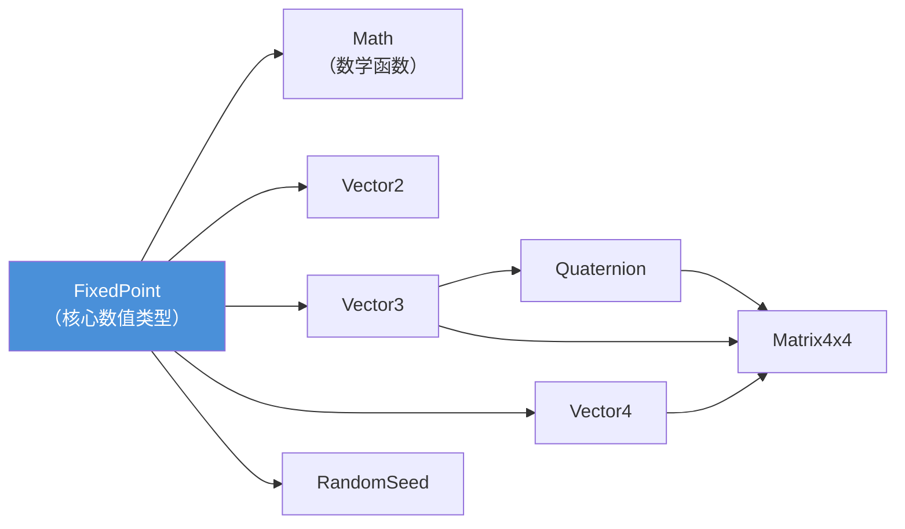
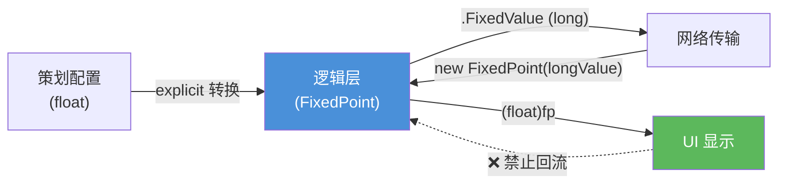

# API 快速参考

这篇文档面向日常开发，按类型分节列出所有公开接口。  
如果想了解背后的设计思路和实现细节，请参考 `2.定点数实现原理.md`。

下面这张图展示了各类型之间的依赖和使用关系，对整体结构有一个直观认识后再看 API 会更容易理解：



---

## 1. 快速上手

第一次接触这个库，建议先运行下面这段代码，对基本用法建立一个感性认识：

```csharp
// ============================================
// 创建定点数
// int 会通过隐式转换自动变成 FixedPoint
// 内部会将值乘以 1024 存储（Q10 格式）
// ============================================
FixedPoint hp = 100;
FixedPoint speed = 6;

// ============================================
// 四则运算
// 运算符已重载，写法和普通数值类型完全一致
// ============================================
FixedPoint damage = hp - speed * 3;
// damage 的真实值 = 100 - 6*3 = 82

// ============================================
// 向量运算
// Vector3 的构造函数接受 int（隐式转为 FixedPoint）
// ============================================
Vector3 pos = new Vector3(10, 0, 5);
Vector3 target = new Vector3(30, 0, 8);
// MoveTowards：从 pos 向 target 移动，最多移动 speed 个单位
Vector3 next = Vector3.MoveTowards(pos, target, speed);

// ============================================
// 三角函数（查找表实现，不依赖 System.Math）
// ============================================
FixedPoint angle = Math.Atan2(new FixedPoint(1), new FixedPoint(1));
FixedPoint degrees = angle * Math.Rad2Deg;
// degrees ≈ 45

// ============================================
// 确定性随机数
// 同种子 + 同调用顺序 = 同结果，适合帧同步
// ============================================
RandomSeed rng = new RandomSeed(42);
int roll = rng.Range(0, 100);   // 返回 [0, 100) 之间的随机整数

// ============================================
// 显示给 UI
// 必须手动写 (float) 强转 —— explicit 设计
// 这个强转标记提醒开发者"这里离开了定点世界"
// ============================================
float uiHp = (float)hp;
ShowUI(uiHp);
```

---

## 2. FixedPoint

### 2.1 常量

```csharp
FixedPoint.Zero          // 0
FixedPoint.One           // 1
FixedPoint.Two           // 2
FixedPoint.NegativeOne   // -1
FixedPoint.Epsilon       // 最小精度 ≈ 0.001（内部值为 1，即 1/1024）
FixedPoint.Pi            // π ≈ 3.142（内部值 3217）
FixedPoint.TwoPi         // 2π ≈ 6.283（内部值 6434）
FixedPoint.PiOver2       // π/2 ≈ 1.571（内部值 1609）
FixedPoint.MaxValue      // 有效最大值 ≈ 2.147 × 10⁹
FixedPoint.MinValue      // 有效最小值 ≈ -2.147 × 10⁹（= -MaxValue）
FixedPoint.MULTIPLE      // 放大倍率 = 1024
```

### 2.2 创建定点数

本库提供 4 种构造方式，语义各不相同：

```csharp
// --------------------------------------------------
// 方式 1：int 构造（最常用）
// 将整数视为"真实值"，内部自动乘以 1024
// --------------------------------------------------
FixedPoint a = new FixedPoint(5);   // 内部值 = 5 × 1024 = 5120
FixedPoint b = 5;                   // 等价写法，利用 int → FixedPoint 的隐式转换

// --------------------------------------------------
// 方式 2：long 构造（底层/网络用）
// 直接存储传入的值，不做任何变换
// 注意：这里的 5L 代表的是"内部值 5"，真实值 ≈ 0.005
// --------------------------------------------------
FixedPoint c = new FixedPoint(5L);  // 真实值 = 5 / 1024 ≈ 0.005

// --------------------------------------------------
// 方式 3/4：float / double 构造
// 仅用于从配置表加载数据，核心逻辑中不应使用
// --------------------------------------------------
FixedPoint d = new FixedPoint(1.5f);  // 内部值 = round(1.5 × 1024) = 1536
FixedPoint e = new FixedPoint(1.5);   // 效果相同
```

**int 和 long 构造函数的区别是最常见的错误来源。** `new FixedPoint(5)` 是真实值 5，而 `new FixedPoint(5L)` 是内部值 5（真实值约 0.005），两者相差 1024 倍。如果发现数值莫名其妙地偏小了三个数量级，首先检查是否误用了 long 构造函数。

### 2.3 类型转换

```csharp
FixedPoint fp = 100;

// ---- 进入定点世界 ----

// int → FixedPoint：隐式（自动转换，无需额外语法）
FixedPoint x = 42;

// float/double → FixedPoint：显式（必须手动强转）
FixedPoint y = (FixedPoint)3.14f;

// ---- 离开定点世界 ----

// FixedPoint → float/double：显式（仅用于 UI 显示）
float displayValue = (float)fp;
double displayValue2 = (double)fp;

// FixedPoint → int：显式（四舍五入取整）
int rounded = (int)fp;

// FixedPoint → long：显式（返回内部放大后的原始值）
long rawValue = (long)fp;
```

所有"离开定点世界"的转换都是 explicit 的。这意味着如果在逻辑层误写了 `float x = myFP;`，编译器会直接报错，而不是悄悄执行转换。

### 2.4 属性

```csharp
FixedPoint fp = new FixedPoint(3);

fp.FixedValue   // long  → 内部放大后的值，此处为 3072
fp.RawFloat     // float → 还原后的近似值，保留 3 位小数，此处为 3.0f
fp.RawDouble    // double → 同上，精度更高
fp.RawInt       // int   → 四舍五入后的整数，此处为 3
```

`RawFloat` 和 `RawDouble` 内部会调用 `System.Math.Round`，返回的是浮点数。在逻辑层中不要使用这些属性的返回值参与后续运算，它们的设计目的是给 UI 显示用的。

### 2.5 运算符

```csharp
FixedPoint a = 10;
FixedPoint b = 3;

// 四则运算
FixedPoint sum  = a + b;      // 13
FixedPoint diff = a - b;      // 7
FixedPoint prod = a * b;      // 30
FixedPoint quot = a / b;      // ≈ 3.333（Q10 精度下的近似值）
FixedPoint rem  = a % b;      // 1

// 一元运算
FixedPoint neg = -a;           // -10

// 移位
FixedPoint shifted = a << 2;   // 40（左移 2 位 = 乘以 4）

// 比较运算（全部已重载）
bool eq = (a == b);    // false
bool ne = (a != b);    // true
bool gt = (a > b);     // true
bool lt = (a < b);     // false
bool ge = (a >= b);    // true
bool le = (a <= b);    // false
```

**除零行为：** 除法和取模遵循饱和策略，除数为零时不抛异常。除法中 `0/0` 返回 `Zero`，正数除以零返回 `MaxValue`，负数除以零返回 `MinValue`；取模中除数为零返回 `Zero`。乘法和左移在中间结果溢出时同样返回饱和值。整个库的设计原则是"不崩溃"，运算结果可能不精确，但不会因为边界输入导致逻辑层抛异常。

---

## 3. Math

### 3.1 基础数学

```csharp
Math.Abs(new FixedPoint(-5))        // 5（取绝对值）
Math.Max(a, b)                      // 返回较大值
Math.Min(a, b)                      // 返回较小值
Math.Sign(new FixedPoint(-3))       // -1（正数或零返回 1，负数返回 -1）
Math.Sqrt(new FixedPoint(9))        // 3（牛顿迭代法，位长度估算初始值，默认 8 次迭代）
Math.Sqrt(new FixedPoint(9), 12)    // 3（指定迭代次数，适用于需要更高精度或更大输入范围的场景）
Math.RSqrt(x)                       // 1/√x（倒数平方根）
Math.Rcp(x)                         // 1/x（倒数）
```

### 3.2 幂运算

```csharp
// 整数指数：使用快速幂算法，效率高
Math.Pow(new FixedPoint(2), 10)     // 1024（2¹⁰）

// 定点指数：通过 Exp 和 Ln 转换计算，底数必须为正
Math.Pow(base, exponent)            // base^exponent
```

### 3.3 对数和指数

```csharp
Math.Log2(x)     // 以 2 为底的对数
Math.Ln(x)       // 自然对数
Math.Log10(x)    // 常用对数（以 10 为底）
Math.Exp(x)      // e^x
Math.Exp2(x)     // 2^x
```

Log 系列函数的输入必须为正数，传入零或负数会抛出异常。

### 3.4 取整

```csharp
// 以真实值 2.7 为例演示各种取整行为
FixedPoint v = new FixedPoint(2.7);   // 仅为演示，实际逻辑中用 int 构造

// 返回 FixedPoint
Math.Round(v)       // 四舍五入 → 3.0
Math.Floor(v)       // 向负无穷取整 → 2.0（位操作实现）
Math.Ceiling(v)     // 向正无穷取整 → 3.0（位操作实现）
Math.Truncate(v)    // 向零取整 → 2.0（截断小数部分）
Math.Fract(v)       // 小数部分 → 0.7（结果始终 ≥ 0）

// 返回 int
Math.RoundToInt(v)  // 3
Math.FloorToInt(v)  // 2
Math.CeilToInt(v)   // 3
```

### 3.5 钳制

```csharp
// 将 value 限制在 [min, max] 范围内
Math.Clamp(value, min, max)

// int 重载版本
Math.Clamp(intValue, 0, 100)

// 限制在 [0, 1]，做插值系数处理时很常用
Math.Clamp01(value)
```

### 3.6 三角函数

全部基于查找表实现，不依赖 `System.Math`，跨平台结果完全一致。

```csharp
// ---- 正向三角函数（输入为弧度） ----
Math.Sin(radians)       // 正弦（查找表 + 线性插值）
Math.Cos(radians)       // 余弦（查找表 + 线性插值）
Math.Tan(radians)       // 正切（= Sin / Cos，Cos 为零时返回饱和值）

// 同时计算 sin 和 cos
// 比分别调用 Sin() 和 Cos() 快，因为归约和索引计算只做一次
Math.SinCos(radians, out FixedPoint sin, out FixedPoint cos);

// ---- 反三角函数 ----
Math.Acos(value)        // 反余弦，输入范围 [-1, 1]，返回弧度（查找表 + 线性插值）
Math.Asin(value)        // 反正弦（内部实现为 π/2 - Acos）
Math.Atan(value)        // 反正切
Math.Atan2(fy, fx)      // 四象限反正切，返回 (-π, π]（二维查找表 + 双线性插值）
```

`Tan` 的实现是 `Sin / Cos`。当 Cos 为零时（如 π/2），除法会触发饱和处理（返回 `MaxValue` 或 `MinValue`），而不是抛出异常。这与库整体的"不崩溃"设计保持一致。

`Atan2` 有两个重载：一个接受 `FixedPoint` 参数，一个接受 `float`。核心逻辑中应当只使用 FixedPoint 版本，float 版本是为编辑器工具准备的。

### 3.7 角度弧度转换

```csharp
// ---- 方式 1：乘常量（快速，精度略低） ----
FixedPoint rad = degrees * Math.Deg2Rad;   // Deg2Rad ≈ 0.0176
FixedPoint deg = radians * Math.Rad2Deg;   // Rad2Deg ≈ 57.296

// ---- 方式 2：调方法（精度更高，多一次除法运算） ----
FixedPoint rad2 = Math.DegreesToRadians(degrees);   // 单次四舍五入除法，精度更高
FixedPoint deg2 = Math.RadiansToDegrees(radians);   // 同上
```

大多数场景使用常量乘法即可。在需要高精度的场景（如累积旋转角度）中使用方法版本。

### 3.8 角度工具

```csharp
// 将弧度归一化到 [-π, π) 范围内（处理累积旋转溢出）
FixedPoint normalized = Math.NormalizeRadians(accumulatedRadians);

// 计算两个角度之间的最短差值（自动处理 360° 回绕）
// 例如 DeltaAngle(350, 10) 返回 20，而非 -340
FixedPoint delta = Math.DeltaAngle(current, target);

// 角度插值，t 在 [0, 1] 之间（自动处理回绕）
FixedPoint angle = Math.LerpAngle(from, to, t);

// 每帧最多旋转 maxDelta 度，逐步逼近目标角度
FixedPoint angle = Math.MoveTowardsAngle(current, target, maxDelta);
```

### 3.9 插值

```csharp
// 线性插值：t 被钳制到 [0, 1]
FixedPoint v = Math.Lerp(a, b, t);

// 线性插值：t 不钳制，可用于外推
FixedPoint v = Math.LerpUnclamped(a, b, t);

// 反向插值：返回 value 在 [a, b] 区间中所处的比例位置
// 例如 InverseLerp(0, 100, 75) 返回 0.75
FixedPoint t = Math.InverseLerp(a, b, value);

// 重映射：将 value 从 [inMin, inMax] 映射到 [outMin, outMax]（结果钳制在输出区间内）
// 例如将血量 [0, 100] 映射到血条宽度 [0, 200]
FixedPoint barWidth = Math.Remap(new FixedPoint(0), new FixedPoint(100),
    new FixedPoint(0), new FixedPoint(200), currentHp);

// 向目标移动，每次最多移动 maxDelta
FixedPoint v = Math.MoveTowards(current, target, maxDelta);

// Hermite 平滑插值（S 型曲线：起点和终点附近速度慢，中间快）
FixedPoint v = Math.SmoothStep(from, to, t);

// 弹簧阻尼平滑（常用于相机跟随、UI 弹性效果）
FixedPoint v = Math.SmoothDamp(
    current,       // 当前值
    target,        // 目标值
    ref velocity,  // 当前速度（会被修改，需要在帧间保持）
    smoothTime,    // 平滑时间
    deltaTime,     // !! 必须是固定步长的定点值，绝不能用 Time.deltaTime !!
    maxSpeed       // 最大速度
);
```

### 3.10 周期函数

```csharp
// 循环取值：结果始终 ≥ 0（类似取模但对负数行为不同）
// Repeat(-1, 10) = 9（不是 -1）
Math.Repeat(t, length);

// 乒乓循环：值在 0 和 length 之间来回往返
// t=0→0, t=5→5, t=10→10, t=15→5, t=20→0
Math.PingPong(t, length);
```

### 3.11 近似比较

```csharp
// 判断两个值之差是否在最小精度（Epsilon）以内
bool same = Math.Approximately(a, b);
// 等价于 Math.Abs(a - b) <= FixedPoint.Epsilon
```

---

## 4. Vector2

### 4.1 创建

```csharp
// 标准写法
Vector2 v1 = new Vector2(new FixedPoint(3), new FixedPoint(4));

// 利用 int 隐式转换的简写
Vector2 v2 = new Vector2(3, 4);

// 也有 float 参数的构造函数，但仅用于初始化阶段
Vector2 v3 = new Vector2(1.5f, 2.5f);
```

### 4.2 分量与属性

```csharp
v.x                 // FixedPoint，X 分量
v.y                 // FixedPoint，Y 分量
v.Magnitude         // FixedPoint，向量长度（内部调用 Sqrt，有计算开销）
v.SqrMagnitude      // FixedPoint，长度的平方（不开方，计算量小得多）
v.Normalized        // Vector2，单位向量（方向相同，长度为 1）
```

在只需要比较距离大小的场景中，使用 `SqrMagnitude` 代替 `Magnitude` 可以避免开方运算：

```csharp
// 判断 a 和 b 之间的距离是否小于 10
// 用 SqrMagnitude 比较 10² = 100，省掉一次 Sqrt
FixedPoint threshold = new FixedPoint(100);   // 10²
if ((a - b).SqrMagnitude < threshold)
{
    // 在范围内
}
```

### 4.3 预定义常量

```csharp
Vector2.Zero     // (0, 0)
Vector2.One      // (1, 1)
Vector2.Up       // (0, 1)
Vector2.Down     // (0, -1)
Vector2.Left     // (-1, 0)
Vector2.Right    // (1, 0)
```

### 4.4 静态方法

```csharp
Vector2.Dot(a, b)                          // 点积
Vector2.Distance(a, b)                     // 两点距离
Vector2.Angle(from, to)                    // 无符号夹角（度）
Vector2.SignedAngle(from, to)              // 有符号夹角（度）
Vector2.Lerp(a, b, t)                      // 线性插值（t 钳制到 [0, 1]）
Vector2.LerpUnclamped(a, b, t)             // 线性插值（t 不钳制）
Vector2.MoveTowards(current, target, d)    // 向目标移动，最多移动 d
Vector2.Reflect(direction, normal)         // 反射
Vector2.Perpendicular(direction)           // 垂直向量
Vector2.Rotate(v, degrees)                 // 旋转指定角度
Vector2.ClampMagnitude(v, maxLength)       // 限制向量长度
Vector2.Scale(a, b)                        // 各分量对应相乘
Vector2.Min(a, b)                          // 各分量取较小值
Vector2.Max(a, b)                          // 各分量取较大值
Vector2.SmoothDamp(...)                    // 弹簧阻尼平滑
```

### 4.5 运算符

```csharp
a + b       // 向量加法
a - b       // 向量减法
a * b       // 各分量对应相乘（注意：不是点积）
a / b       // 各分量对应相除
a * scalar  // 标量乘法（scalar 为 FixedPoint）
a / scalar  // 标量除法
-a          // 取反
a == b      // 相等判断
a != b      // 不等判断
```

### 4.6 类型转换

```csharp
// Vector2 → Vector3：隐式转换，z 分量自动补 0
Vector3 v3 = someVector2;
```

---

## 5. Vector3

在 Vector2 的基础上增加了 z 分量。大部分方法（Dot、Distance、Lerp、MoveTowards、Reflect、SmoothDamp 等）与 Vector2 用法完全相同，此处只列出 Vector3 独有的内容。

### 5.1 额外的预定义常量

```csharp
Vector3.Forward    // (0, 0, 1)
Vector3.Back       // (0, 0, -1)
// Up / Down / Left / Right / Zero / One 与 Vector2 含义相同，多了 z 分量
```

### 5.2 Vector3 独有方法

```csharp
// 叉积：返回同时垂直于 a 和 b 的向量（二维向量没有叉积）
Vector3.Cross(a, b)

// 将 v 投影到 onNormal 方向上
Vector3.Project(v, onNormal)

// 将 v 投影到法线为 planeNormal 的平面上
Vector3.ProjectOnPlane(v, planeNormal)

// 围绕指定轴的有符号夹角（度）
Vector3.SignedAngle(from, to, axis)

// 弧度制的无符号夹角
Vector3.AngleBetween(from, to)

// 从 fromThat 中排除 excludeThis 方向的分量
Vector3.Exclude(excludeThis, fromThat)
```

---

## 6. Vector4

四维向量，主要用于 Matrix4x4 运算（齐次坐标）。日常游戏逻辑中直接使用的场景较少。

```csharp
Vector4 v = new Vector4(1, 2, 3, 4);   // x, y, z, w

// 提供的方法与 Vector2/Vector3 类似：
// Dot, Distance, Lerp, MoveTowards, Normalize, Min, Max, Scale, Project
```

类型转换（全部为隐式）：

```csharp
// Vector2 → Vector4：z=0, w=0
// Vector3 → Vector4：w=0
// Vector4 → Vector2：只保留 x, y
// Vector4 → Vector3：只保留 x, y, z
```

---

## 7. Quaternion

四元数，用于 3D 旋转的表示和运算。接口风格与 Unity 的 `UnityEngine.Quaternion` 保持一致。

### 7.1 创建

```csharp
// 从欧拉角创建（参数为度数）
Quaternion q1 = Quaternion.Euler(0, 90, 0);            // 绕 Y 轴旋转 90°
Quaternion q2 = Quaternion.Euler(eulerAngleVector3);   // 从 Vector3 创建

// 绕指定轴旋转指定角度
Quaternion q3 = Quaternion.AngleAxis(new FixedPoint(45), Vector3.Up);

// 从一个方向旋转到另一个方向的最短旋转
Quaternion q4 = Quaternion.FromToRotation(Vector3.Forward, targetDirection);

// 构造"朝向某方向"的旋转
Quaternion q5 = Quaternion.LookRotation(forward);
Quaternion q6 = Quaternion.LookRotation(forward, upwards);   // 指定上方向
```

### 7.2 常用属性与方法

```csharp
Quaternion.Identity          // 无旋转的单位四元数 (0, 0, 0, 1)
q.Normalized                 // 返回单位化后的副本
q.EulerAngles                // 转换为欧拉角（度，ZXY 顺序，与 Unity 一致）

Quaternion.Dot(a, b)         // 四元数点积
Quaternion.Angle(a, b)       // 两个旋转之间的角度差（度）
Quaternion.Inverse(q)        // 逆旋转
q.Normalize()                // 就地单位化（修改自身）
```

### 7.3 插值

```csharp
// 球面线性插值（旋转动画中最常用的插值方式）
Quaternion q = Quaternion.Slerp(from, to, t);            // t 钳制到 [0, 1]
Quaternion q = Quaternion.SlerpUnclamped(from, to, t);   // t 不钳制

// 线性插值后归一化（比 Slerp 快，但角度较大时精度稍低）
Quaternion q = Quaternion.Lerp(from, to, t);

// 逐步旋转：每次最多旋转 maxDegreesDelta 度
Quaternion q = Quaternion.RotateTowards(from, to, maxDegreesDelta);
```

### 7.4 运算符

```csharp
// 组合旋转：先应用 q2，再应用 q1（注意顺序）
Quaternion combined = q1 * q2;

// 用四元数旋转一个点/向量
Vector3 rotated = q * point;
```

---

## 8. Matrix4x4

4×4 矩阵，用于组合变换（平移 + 旋转 + 缩放）。行优先存储。

### 8.1 创建

```csharp
// 最常用：同时指定平移、旋转、缩放
Matrix4x4 m = Matrix4x4.TRS(position, rotation, scale);

// 单独创建某种变换
Matrix4x4 scaleMatrix = Matrix4x4.Scale(new Vector3(2, 2, 2));
Matrix4x4 translateMatrix = Matrix4x4.Translate(new Vector3(10, 0, 5));
Matrix4x4 rotateMatrix = Matrix4x4.Rotate(someQuaternion);
```

### 8.2 常用属性

```csharp
Matrix4x4.Identity     // 单位矩阵（变换恒等，不产生任何变化）
Matrix4x4.Zero         // 零矩阵
m.Transpose            // 转置矩阵
m.Determinant          // 行列式
m.Inverse              // 逆矩阵
```

### 8.3 变换点与方向

```csharp
// 变换一个点（应用平移 + 旋转 + 缩放，含透视除法）
Vector3 worldPos = m.MultiplyPoint(localPos);

// 仿射变换版本（忽略第四行，更快，适用于不含透视的常规变换）
Vector3 worldPos = m.MultiplyPoint3x4(localPos);

// 变换一个方向向量（只旋转和缩放，不平移）
Vector3 worldDir = m.MultiplyVector(localDir);
```

### 8.4 行列操作

```csharp
Vector4 row = m.GetRow(0);                // 获取第 0 行
m.SetRow(0, new Vector4(...));            // 设置第 0 行
Vector4 col = m.GetColumn(0);             // 获取第 0 列
m.SetColumn(0, new Vector4(...));         // 设置第 0 列
```

### 8.5 运算符

```csharp
Matrix4x4 combined = m1 * m2;     // 矩阵乘法（组合变换）
Vector4 result = m * vec4;        // 矩阵乘向量
```

---

## 9. RandomSeed

### 9.1 创建

```csharp
// 使用指定种子初始化
// 种子为 0 时内部会自动替换为默认非零值（Xorshift 要求状态不为 0）
RandomSeed rng = new RandomSeed(42);
```

### 9.2 生成随机数

```csharp
// 生成 [min, max) 范围内的随机整数
int roll = rng.Range(0, 100);       // 返回 0~99 之间的整数

// FixedPoint 重载，返回范围内的整数部分
int value = rng.Range(minFP, maxFP);
```

### 9.3 属性

```csharp
rng.SeedId    // 获取初始种子值
```

### 9.4 帧同步中的使用规则

逻辑层和表现层必须使用各自独立的 `RandomSeed` 实例。原因是表现层的执行路径在不同客户端上可能不一致（例如某个粒子特效在低配设备上被裁剪），导致随机数调用次数不同，从而使逻辑层的随机序列产生偏移。

---

## 10. 数据流向速查

在写代码之前，先明确数据在各层之间如何流动：



---

## 11. 常见错误与正确做法

### 11.1 int / long 构造函数混淆

```csharp
// ✗ 错误：这是内部值 5，真实值约 0.005
FixedPoint fp = new FixedPoint(5L);

// ✓ 正确：这是真实值 5
FixedPoint fp = new FixedPoint(5);
// ✓ 或者直接利用隐式转换
FixedPoint fp = 5;
```

### 11.2 将 RawFloat 的值回流到逻辑层

```csharp
// ✗ 错误：浮点值重新参与了逻辑运算，破坏确定性
float temp = fp.RawFloat;
// ... 一系列浮点运算 ...
FixedPoint result = (FixedPoint)temp;   // 不同平台结果可能不同

// ✓ 正确：逻辑层全程使用 FixedPoint，RawFloat 只在最终显示时使用
FixedPoint result = fp * someOtherFP;
float uiValue = (float)result;          // 仅用于 UI
```

### 11.3 在逻辑层调用了 System.Math

```csharp
// ✗ 错误：System.Math.Sin 走的是浮点路径
double sinVal = System.Math.Sin(someAngle);

// ✓ 正确：使用本库的 Math（Tao.FixedPoint 命名空间），查表实现
FixedPoint sinVal = Math.Sin(someRadians);
```

如果同时 using 了 `System` 和 `Tao.FixedPoint`，注意不要误调到 `System.Math`。

### 11.4 SmoothDamp 传入了浮点帧时间

```csharp
// ✗ 错误：Time.deltaTime 是浮点数，且每帧不同，各端不一致
Math.SmoothDamp(current, target, ref vel, smoothTime,
                (FixedPoint)Time.deltaTime, maxSpeed);

// ✓ 正确：使用固定步长（帧同步本身就是定步长驱动的）
FixedPoint fixedDt = new FixedPoint(16);   // 16ms 固定步长
Math.SmoothDamp(current, target, ref vel, smoothTime, fixedDt, maxSpeed);
```

### 11.5 网络传输使用了 float 或字符串

```csharp
// ✗ 错误：float 跨平台不一致
SendToServer(fp.RawFloat);

// ✗ 错误：字符串受区域设置影响（法国用逗号作小数点）
SendToServer(fp.ToString());

// ✓ 正确：传输内部的 long 值，所有平台完全一致
SendToServer(fp.FixedValue);
```

### 11.6 逻辑层与表现层共用 RandomSeed

```csharp
// ✗ 错误：逻辑和表现共用同一个 rng 实例
RandomSeed rng = new RandomSeed(42);
// 逻辑层用 rng.Range(...)
// 表现层也用 rng.Range(...)  ← 各端调用次数可能不同，后续序列全部错位

// ✓ 正确：各自持有独立的实例
RandomSeed logicRng = new RandomSeed(42);        // 逻辑层专用
RandomSeed renderRng = new RandomSeed(12345);    // 表现层专用
```

---

## 12. 源文件结构

```text
Tao/FixedPoint/
├── Core/FixedPoint.cs                      ← 定点数核心结构体
├── Math/Math.cs                            ← 数学函数
├── Math/LookupTable/SinCosLookupTable.cs   ← Sin/Cos 查找表
├── Math/LookupTable/AcosLookupTable.cs     ← Acos 查找表
├── Math/LookupTable/Atan2LookupTable.cs    ← Atan2 查找表
├── Vector/Vector2.cs                       ← 二维向量
├── Vector/Vector3.cs                       ← 三维向量
├── Vector/Vector4.cs                       ← 四维向量
├── Quaternion/Quaternion.cs                ← 四元数
├── Matrix/Matrix4x4.cs                     ← 4×4 矩阵
└── Random/RandomSeed.cs                    ← 确定性随机数
```
