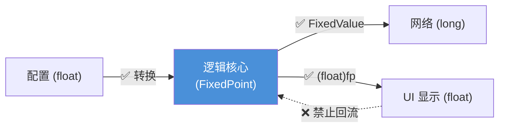
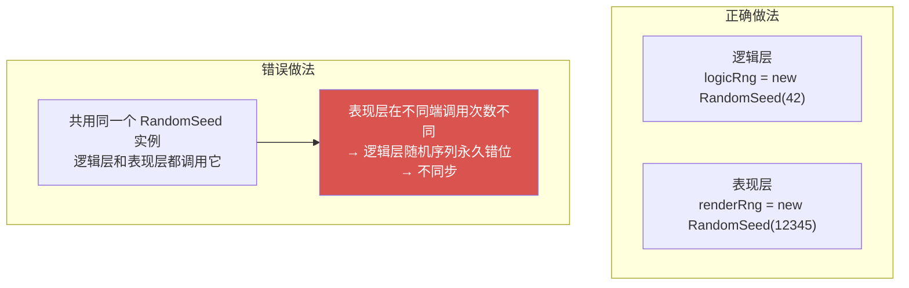

# 规范合规说明

这篇文档面向库的维护者和使用者，明确编码规范和帧同步使用约束。  
如果只需要调用 API，`3.API快速参考.md` 已经足够，本文档可以在需要时再阅读。

---

## 1. 命名规范

### 1.1 总体规则

| 成员类型 | 命名方式 | 示例 |
|---|---|---|
| 公共类型、方法、属性 | PascalCase | `FixedPoint`、`Sqrt`、`Magnitude` |
| 私有字段 | _camelCase | `_fixedValue`、`_state` |
| 方法参数、局部变量 | camelCase | `radians`、`maxDelta`、`index` |
| 常量 | ALL_CAPS | `MAX_VALUE`、`BIT_MOVE_COUNT`、`MULTIPLE` |
| 向量/四元数分量 | 小写字母 | `x`、`y`、`z`、`w` |
| 矩阵分量 | 小写 mRC 格式 | `m00`、`m01`、`m33` |

### 1.2 向量分量使用小写的原因

按照 C# 的公共字段规范，应当使用 PascalCase（`X`、`Y`、`Z`）。但本库选择了小写 `x/y/z/w`，原因如下：

- 数学和图形学领域（Unity、GLSL、HLSL、线性代数教材）普遍使用小写
- Unity 的 `UnityEngine.Vector2/Vector3` 使用小写，保持一致可以降低迁移成本
- 使用者已经形成了 `v.x` 的肌肉记忆，改成 `v.X` 会造成不必要的认知负担

矩阵分量 `m00` ~ `m33` 同样遵循 Unity `Matrix4x4` 的命名惯例。

---

## 2. 注释规范

### 2.1 公共 API 的文档注释

所有 `public` 方法、属性和字段必须附带 XML 文档注释：

```csharp
/// <summary>
/// 平方根 (牛顿迭代法，位长度估算初始值)
/// </summary>
/// <param name="value">被开方的值（必须非负）</param>
/// <returns>value 的平方根</returns>
public static FixedPoint Sqrt(FixedPoint value)
```

在 `<summary>` 中括号标注使用的算法或关键行为（如 `(查找表 + 线性插值)`、`(仅用于表现层)`），这样阅读注释就能快速了解实现策略，不必每次翻看源码。

### 2.2 具体规则

- **`<summary>` 必须填写**，描述该成员的功能，而非实现方式。
- **`<param>` 必须齐全**，每个参数都要注释。
- **注释语言使用中文**，与团队保持统一。
- **避免冗余注释**。代码本身已经表达清楚的逻辑不需要重复注释。例如 `return a + b;` 上方不需要 `// 返回两数之和`。
- **不要在注释中描述代码变更历史**。类似 `// 新增溢出检查` 这样的内容属于 git commit message 的范畴，不应出现在代码注释中。

### 2.3 私有方法

`private` 和 `internal` 方法建议添加简短的 XML 注释。如果算法流程比较复杂，在方法体内部通过行注释对关键步骤进行说明。

---

## 3. 代码组织

### 3.1 文件与类型的对应关系

每个 `.cs` 文件只包含一个 class 或 struct，文件名与类型名保持一致。

### 3.2 #region 分组规则

每个类型内部使用 `#region` 对成员进行分组，建议按以下顺序排列：

| 顺序 | region 名称 | 包含内容 |
|---|---|---|
| 1 | `常量` | `const` 和 `static readonly` 常量 |
| 2 | `字段和属性` | 实例字段、静态缓存字段、公共属性 |
| 3 | `构造函数` | 所有构造函数 |
| 4 | `类型转换` | `implicit` 和 `explicit` 转换运算符 |
| 5 | `运算符` | `+` `-` `*` `/` `==` 等运算符重载 |
| 6 | `公共方法` | 公共的实例方法和静态方法 |
| 7 | `内部辅助` | `private` / `internal` 的辅助方法 |

并非所有类型都需要全部 7 个 region，按实际情况选用。

### 3.3 容易放错的成员

**类型转换运算符不属于"运算符"分组。**

`implicit operator FixedPoint(int value)` 在 C# 语法上是 `operator`，但语义上属于类型系统——它定义的是"int 如何变成 FixedPoint"，而非算术运算。将它与 `+` `-` `*` `/` 混在一起会影响代码的可读性。

**私有辅助方法不属于"公共方法"分组。**

例如 `Saturate()`（饱和钳位）是 `private` 方法，应放在"内部辅助"分组中。"公共方法"分组中只放 `public` 成员，方便使用者快速浏览可用的 API。

---

## 4. 帧同步使用约束

以下规则直接关系到帧同步的正确性。违反其中任何一条都可能导致不同步。

### 4.1 分层使用

| 层级 | 允许使用 | 禁止使用 |
|---|---|---|
| 策划配置 / 编辑器 | `float`、`double` | — |
| 运行时逻辑核心 | `FixedPoint`、`Math`、`Vector*`、`Quaternion`、`Matrix4x4`、`RandomSeed` | `float`、`double`、`System.Math`、`System.Random`、`UnityEngine.Mathf` |
| 网络传输 | `FixedValue`（long 整数） | `float`、`double`、`string` |
| 表现层 / UI | `float`、`double` | 不得将浮点值回流到逻辑层 |

### 4.2 浮点值的单向流动

配置表中读出的浮点值可以转为 FixedPoint 进入逻辑层，但一旦进入逻辑核心，就不能再将浮点值作为输入参与运算。



原因：`FixedPoint → float → 浮点运算 → FixedPoint` 这条链路中，浮点运算步骤在不同平台上可能产生微小差异。即使差异仅在最后一位，转回 FixedPoint 后也可能导致一个最小精度（Epsilon）的偏差，而这个偏差会在后续帧中被持续放大。

### 4.3 随机数隔离

逻辑层和表现层必须使用各自独立的 `RandomSeed` 实例，绝不能共用。



原因：表现层的执行路径在不同客户端上可能不一致。例如某个粒子特效在低配设备上因 LOD 而被跳过，导致表现层少调用了一次随机数。如果两层共用同一个 `RandomSeed` 实例，从那一帧开始逻辑层的随机序列就会在不同客户端之间产生永久性错位。

```csharp
// ✓ 正确做法：各层持有独立实例
RandomSeed logicRng  = new RandomSeed(gameSeed);    // 逻辑层专用
RandomSeed renderRng = new RandomSeed(renderSeed);  // 表现层专用
```

### 4.4 SmoothDamp 的 deltaTime 参数

`Math.SmoothDamp` 的 `deltaTime` 参数必须传入固定步长的定点值。

不能使用 `Time.deltaTime`：它是浮点数，而且每帧的值会随帧率变化。帧同步架构本身就是定步长驱动的，这个参数应当是编译期就确定的常量。

```csharp
// ✗ 错误
Math.SmoothDamp(current, target, ref vel, smoothTime,
                (FixedPoint)Time.deltaTime, maxSpeed);

// ✓ 正确
FixedPoint fixedDt = new FixedPoint(16);   // 16ms 固定步长
Math.SmoothDamp(current, target, ref vel, smoothTime, fixedDt, maxSpeed);
```

---

## 5. 保留浮点入口的设计考量

FixedPoint 保留了 `float`/`double` 的构造函数和类型转换，原因是实际工程中存在无法避免的浮点交互场景：

- 策划配置表通常导出为 float
- 编辑器工具（Inspector、Gizmo）的接口全部基于浮点
- UI 显示最终需要转回 float 传给渲染组件

处理方式是**保留接口但增设防护**：

- `float/double → FixedPoint`：使用 `explicit`，遗漏强转会触发编译错误
- `FixedPoint → float/double`：同样使用 `explicit`，防止无意间转换
- 通过文档规范和 Code Review 约束运行时逻辑层的使用

---

## 6. 常量设计

### 6.1 预计算策略

所有数学常量在代码中直接以 Q10 内部值定义：

```csharp
// 3217 = round(3.14159265 × 1024)
// 使用 long 构造函数，传入的是预先算好的内部值
public static readonly FixedPoint Pi = new FixedPoint(3217L);
```

不使用 `new FixedPoint(3.14159)` 的原因：后者在运行时会执行浮点乘法。虽然只执行一次，影响很小，但既然这些值可以在编码阶段就确定下来，就没有必要让运行时接触浮点运算。

这些常量的数值一旦确定就不能随意修改——已有的存档和回放录像是基于这些值计算的，修改会导致向后兼容性断裂。

### 6.2 其他内部常量

`SmoothDamp` 的衰减系数、`ln(2)`、`log10(2)` 等也都采用预计算的 Q10 值，遵循同样的原则。

---

## 7. 性能相关规范

### 7.1 AggressiveInlining 的使用

库中大量简单方法标记了 `[MethodImpl(MethodImplOptions.AggressiveInlining)]`，例如加减法、比较运算符、`Abs`、`Floor` 等。

```csharp
[MethodImpl(MethodImplOptions.AggressiveInlining)]
public static FixedPoint operator +(FixedPoint a, FixedPoint b)
{
    return new FixedPoint(Saturate(a._fixedValue + b._fixedValue));
}
```

使用标准：

- **适用场景**：方法体很短（一般不超过 3-5 行）、调用频率极高、且不包含循环或复杂分支的方法。典型例子是算术运算符、比较运算符、`Saturate`、`Floor` 等。
- **不适用场景**：方法体较长或包含循环的方法（如 `Sqrt`、`Log2`、`Exp`）。强制内联这类方法会增大调用方的代码体积，反而可能导致指令缓存命中率下降。
- **不要过度使用**：JIT 编译器本身会对短方法做内联决策，`AggressiveInlining` 只是一个"建议"。对于已经足够短的方法，是否标记的性能差异通常不大，更多是一种编码意图的声明。

### 7.2 struct 而非 class

`FixedPoint`、`Vector2`、`Vector3`、`Quaternion`、`Matrix4x4` 全部使用 `struct` 而非 `class`，原因如下：

- **无 GC 压力**：struct 分配在栈上（或作为其他对象的内联字段），不会产生堆分配和垃圾回收。游戏逻辑中每帧会创建大量临时向量和定点数，如果使用 class，GC 暂停会造成可感知的卡顿。
- **值语义**：`a = b` 是值拷贝而非引用拷贝，修改 `a` 不会影响 `b`。这与数学上数值类型的行为一致，不会出现"修改了一个变量，另一个变量跟着变"的问题。
- **字段使用 `readonly`**：`FixedPoint` 的 `_fixedValue` 字段声明为 `readonly`，保证创建后不可修改。这使得定点数具备不可变性（immutability），所有"修改"操作实际上返回一个新实例。

新增类型时，如果该类型在语义上表示一个数值或数学对象，应当使用 `struct`。

---

## 8. 新增 API 的规范

### 8.1 优先复用现有能力

新增接口前应先检查库中是否已有可组合使用的功能。

例如 `Asin` 不需要从头实现查表逻辑——利用恒等关系 `arcsin(x) = π/2 - arccos(x)` 即可：

```csharp
public static FixedPoint Asin(FixedPoint value) => FixedPoint.PiOver2 - Acos(value);
```

### 8.2 风格一致性

新增方法的命名、参数顺序、注释格式应与现有代码保持统一：
- 方法名 PascalCase
- 参数名 camelCase
- XML 注释使用中文
- `<summary>` 中括号标注算法

### 8.3 ToString 使用 InvariantCulture

所有类型的 `ToString` 实现必须指定 `CultureInfo.InvariantCulture`。

不同的操作系统区域设置会影响数字格式。例如在法语区域设置下，`1.5` 的默认字符串表示是 `"1,5"`（逗号而非句点）。在调试日志对比、序列化等场景中，格式不一致会造成混乱。使用 `InvariantCulture` 可以统一使用句点作为小数分隔符。

---

## 9. Code Review 检查清单

进行代码审查时，按以下条目逐项检查：

1. **文档注释完整性**：公共方法是否包含 `<summary>` 和完整的 `<param>`？
2. **参数命名**：参数名是否具有语义？`radians`、`dividend` 优于 `a`、`b`。
3. **逻辑层浮点隔离**：是否存在 `float`、`double`、`System.Math`、`System.Random` 出现在逻辑核心中的情况？`RawFloat` 是否仅在显示层使用？
4. **API 复用**：新增接口是否复用了现有能力？是否引入了功能重复的方法？
5. **#region 分组**：类型转换运算符是否在"类型转换"分组中？私有方法是否在"内部辅助"分组中？
6. **浮点常量检查**：是否存在硬编码的浮点字面量（如 `3.14159`）代替预计算的定点常量？
7. **溢出安全**：涉及查表或中间乘法的变更，是否验证了在极端输入下不会溢出 long？
8. **随机数调用路径**：随机数调用是否位于确定性执行路径上？表现层的随机是否使用了独立实例？

---

## 10. 维护指南

### 10.1 目录结构

新增模块应遵循现有的目录组织：

```text
Tao/FixedPoint/
├── Core/             ← 核心类型（FixedPoint）
├── Math/             ← 数学函数
│   └── LookupTable/  ← 查找表数据
├── Vector/           ← 向量类型
├── Quaternion/       ← 四元数
├── Matrix/           ← 矩阵
└── Random/           ← 随机数
```

### 10.2 修改查找表的注意事项

查找表的数据是离线阶段用高精度浮点预先计算并硬编码在源码中的。如果需要修改表的精度或采样密度：

1. 修改生成工具的参数并重新运行。
2. 检查 `NomMul`、`Mask` 等衍生常量是否需要同步更新。
3. 检查 `InterpolateTable` 和 `GetIndex` 中的角度归约逻辑在新参数下是否仍然安全——采样密度变化会改变 `NomMul` 的大小，可能影响中间乘积是否溢出。
4. 修改完成后运行完整测试，重点覆盖边界值（0、π/2、π、2π）和超大角度（如 10000π）。

### 10.3 版本兼容性

以下变更属于 breaking change，会导致已有存档、回放录像或网络协议不兼容：

- **修改 `FixedValue` 属性名**：这是对外的序列化接口。
- **修改数学常量的内部值**（Pi、TwoPi 等）：已有数据是基于这些值计算的。
- **修改公共 API 签名**（参数类型或个数）：所有调用方都需要同步修改。

如确需做此类变更，应升级主版本号，并在 changelog 中明确标注 breaking change。

### 10.4 测试覆盖建议

最低限度应覆盖以下场景：

- 每个数学函数的边界输入：0、正数、负数、MaxValue、MinValue
- 三角函数的周期边界：0、π/2、π、3π/2、2π，以及超大角度（验证归约正确性）
- 向量函数的特殊输入：零向量、单位向量、平行向量、垂直向量
- 随机数的可复现性：相同种子 + 相同调用顺序产生相同结果
- 算术运算的溢出场景：接近 MaxValue 的值参与乘法或加法
- 负数路径：所有涉及负数的运算（尤其是乘法和取整）验证行为正确
